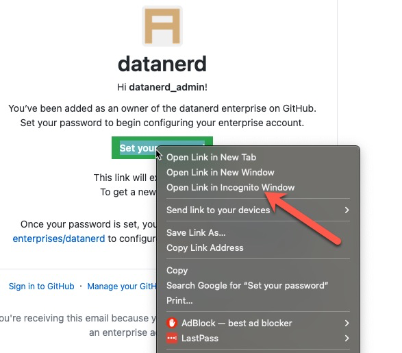

## EMU 초기 설정 (트라이얼 포함)

### 1. 최초 관리자 EMU초대 이메일 수신, 패스워드 설정

- EMU에 사용할 Short-code와, 최초 관리자 분의 이메일주소를 GitHub에 전달
- GitHub에서 EMU 엔터프라이즈를 생성하고, 최초 관리자 분의 이메일주소로 invite링크가 담긴 이메일을 보내드립니다. 
- 최초 admin 계정은 short-code 뒤에 admin을 붙여 'short-code_admin' 이란 계정으로 생성되며, 최초 관리자 분이 수신된 이메일의 패스워드 셋업를 누르시고 초기 패스워드를 셋업합니다. 

### (주의!) 수신된 이메일에서 패스워드 셋업 링크를 누르실 때, 반드시 브라우저의 '시크릿 창'을 사용!!! 

- 기존에 만약 GitHub.com 사이트를 열어놓은 브라우져 창이 있다면, 해당 GitHub.com 계정으로 설정되어, 오류를 일으키기 때문입니다.
- 이후에도 EMU계정과, GitHub.com의 개인 계정은 별도이므로 동일한 브라우저에서 사용하면 에러가 발생하므로, 다른 별도의 브라우저로 사용해야 합니다. 

### 2. [SAML SSO 설정](https://docs.github.com/en/enterprise-cloud@latest/admin/identity-and-access-management/using-enterprise-managed-users-for-iam/configuring-saml-single-sign-on-for-enterprise-managed-users#configuring-your-identity-provider) 
- 현재 AzureAD, Okta지원되며, PingFederate(public beta)입니다. 
- 각각의 IdP 구성의 절차에 따라, SAML SSO를 설정해 줍니다. 
- OIDC(현재 AzureAD만 가능)로 구성하면, GitHub은 자동으로 IdP의 Conditional Access Policy(CAP)를 사용합니다. 

### 3. [Auto Provisioning 구성(SCIM)](https://docs.github.com/en/enterprise-cloud@latest/admin/identity-and-access-management/using-enterprise-managed-users-for-iam/configuring-scim-provisioning-for-enterprise-managed-users)
- Auto Provisioning (SCIM)은 반드시 구성해 주어야 합니다.
- IdP에서 구성된 사용자들의 생성, 삭제, 수정이 자동으로 EMU로 적용됩니다.  

### 4. 사용자 추가시 'Role'
- IdP에서 EMU 어플리케이션에 대해 사용자를 추가할 때, 역할(role)설정이 가능하며,
- 'Enterprise Owner' 역할은, EMU에 대한 관리자 역할
- 'Member'는 일반 사용자 역할이 부여됩니다. 

### 5. [IdP의 Group과 Team연동](https://docs.github.com/en/enterprise-cloud@latest/admin/identity-and-access-management/managing-iam-with-enterprise-managed-users/managing-team-memberships-with-identity-provider-groups#managing-the-connection-between-an-existing-team-and-an-idp-group)
- IdP의 Group과 GitHub의 Team을 sync해 주는 기능입니다. 
- IdP의 Group의 멤버쉽에 변화가 생기면, 이를 자동으로 GitHub의 Team에 반영해 줍니다. 
- GitHub에서 Team을 생성할 때, 혹은 존재하는 Team을 IdP의 Group과 연결합니다. 