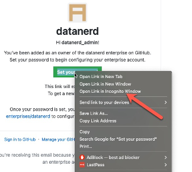
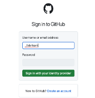

## Short Code

EMU를 신청해 주실 때, 정해 주신 Short code는, GitHub.com상의 EMU서비스에서 각 엔터프라이즈 기업을 구분해 주는 ‘기업 코드’이자, 각 기업을 구별해 주는 구별자 입니다. 
-	3~8글자의 Alphanumeric 코드 입니다. 
-	기업 내부에서만 사용되는 것이므로 특별한 의미가 있는 것은 아닙니다. 
-	한번 설정되면 변경이 불가능 합니다. 
-	EMU최초 설정시, ‘최초 EMU관리자’의 username은 다음과 같이 설정됩니다. 
: `Short code_admin`
(예) short code가 `fabrikam` 이라면 : fabrikam_admin

  

## EMU설정 순서

EMU의 설정은 아래와 같은 순서로 진행됩니다.  

1.	GitHub으로 부터 받은 관리자 초대 이메일의 버튼 클릭하여 ‘관리자 패스워드' 설정
2.	Configure SAML SSO / SCIM for GitHub Enterprise
3.	사용자의 EMU 로그인

 

### [1] 관리자 초대 메일을 통해 ‘관리자 패스워드’ 설정
 
GitHub에서 EMU가 설정되면, 사전에 전달해 주셨던 관리자 이메일로 아래와 같은 초대 이메일이 전송됩니다. 

!!!주의!!! ** ** 주의 ** : ** 반드시 브라우저의 ‘시크릿 페이지' 혹은, 별도의 브라우저 어플리케이션을 통해 패스워드를 설정 ** 해 주시기 바랍니다. (기존에 열려 있던 브라우저상에 GitHub.com으로의 다른 세션이 있다면, 이 세션으로 인해 문제가 발생합니다)

  

!!!주의!!!#### ** !!주의!! **   설정해 주신 패스워드와, 패스워드 설정시에 나오는  Recovery 코드는 꼭 잘 저장하셔서, 분실되지 않도록 잘 관리   되어야 합니다. 

!!!주의!!!** GitHub 상의 관리페이지는 ** https://github.com/enterprises/ \<your enterprise name> **  입니다. 이 URL은 최초 패스워드 설정하고 로그인되었던 화면의 페이지 URL입니다. 관리 페이지 주소를 분실하지 않도록 잘 관리 되어야 합니다. 
  
!!!주의!!!*** 관리페이지 URL의 ** \<your enterprise name> **  : 이 부분은, 아래 2번 SSO 설정과 Auto-provisioning 설정에서 사용됩니다.
  

### [2] SAML SSO 와 SCIM 설정 
  
  사용자 추가를 위해 EntraID와의 SAML SSO 설정 및 SCIM(Auto provisioning기능) 설정이 필요합니다. 
  ** 이 작업을 위해서는 Azure EntraID의 관리자 계정이 필요합니다. 
  
  (아래는 [Microsoft Entra ID SSO - GitHub Enterprise Managed User 설정 가이드](https://learn.microsoft.com/en-us/entra/identity/saas-apps/github-enterprise-managed-user-tutorial)의 내용을 요약한 것입니다.)
  
#### <1> Entra ID에서 설정
  
  1) Entra ID내에 ‘[GitHub Enterprise Managed User](https://azuremarketplace.microsoft.com/en-us/marketplace/apps/aad.githubenterprisemanageduser?tab=Overview)’ 어플리케이션을 설치합니다. 
  2) 위 설치된 GitHub Enterprise Managed User 어플리케이션에 대한 SAML SSO를 설정합니다.
  설정시 필요한 값들은 아래와 같이 설정됩니다. 
  **아래 `<your enterprise name>`값은 1번과정 URL의 `<your enterprise name>`의 값입니다. 
    - Identifier : `https://github.com/enterprises/<your enterprise name>`
    - Reply URL : `https://github.com/enterprises/<your enterprise name >/saml/consume`
    - Sign-on URL : `https://github.com/enterprises/<your enterprise name >/sso`
  3) Certificate을 PEM 포맷으로 다운로드 합니다. 
  4) Login URL, Entra ID Identifier 값을 Copy하여 놓습니다. (이 값들은 이후, GitHub상의 SSO 설정에 추가되는 값들입니다)
  5) [관리자를 추가 합니다.](https://learn.microsoft.com/en-us/entra/identity/saas-apps/github-enterprise-managed-user-tutorial#assign-the-microsoft-entra-test-user) 이때 추가되는 관리자는 GitHub 관리자의 계정(최초 관리자 패스워드 설정을 하신 관리자분)의 계정을 Entra ID에서 찾아 추가합니다.  이 관리자 계정은 아래 <2> 과정의 5)에서 Test SAML Configuration시에 로그인을 위해 필요합니다.  
  -	Select a role 메뉴에서 ‘`Owner`’로 설정합니다. 
  
   
 

#### <2> GitHub 관리페이지에서 설정

1)	GitHub 관리 페이지로 이동합니다. 
2)	왼편의 `Settings > Authentication security` 메뉴로 이동합니다. 
3)	`Require SAML authentication` 체크박스 설정
4)	위 EntraID에서 저장된 값들을 설정합니다. 
    - `Entra ID Login URL` → `Sign on URL`
    - `Entra ID Identifier` → `Issuer`
    - Certificate PEM 파일의 내용을 복사하여 ‘`Pubic certificate`’에 붙여 넣기
5)	‘`Test SAML configuration`’ : 위에 5) 과정에서 추가된 관리자 계정으로 Entra ID에 로그인 합니다. 
6)	Test가 완료되면  반드시 ‘`Save`’ 버튼을 클릭하여 설정을 저장  합니다. 

 

#### <3> SCIM 설정: [Entra ID 설정 가이드](https://learn.microsoft.com/en-us/entra/identity/saas-apps/github-enterprise-managed-user-provisioning-tutorial)

1)	GitHub 관리자 계정의 Personal access token을 생성합니다. ([Personal access token 생성방법](https://docs.github.com/en/enterprise-cloud@latest/admin/identity-and-access-management/provisioning-user-accounts-for-enterprise-managed-users/configuring-scim-provisioning-for-enterprise-managed-users#creating-a-personal-access-token)) 
 <U> ** 여기에서의 ‘GitHub 관리자 계정’은, 앞서 1번 과정에서 ‘관리자 패스워드’를 설정했던 최초 관리자 계정을 의미합니다. </U> 
2)	Entra ID 설정 페이지로 이동합니다. 
3)	GitHub Enterprise Managed User OIDC 어플리케이션에 대한 ‘Provisioning’을 ‘Automatic’으로 설정
a)	Tenant URL 값 : `https://api.github.com/scim/v2/enterprises/<your enterprise name>`
b)	Secret Token은 위 1)에서 설정한 GitHub 관리자의 Personal Access Token 값을 입력합니다. 
c)	Test Connection 실행
4)	‘Provisioning Status’를 ‘On’으로 설정합니다.
5)	Scope을 설정합니다. 
6)	EMU를 사용할 사용자를 추가합니다. (Select a role 메뉴에서 ‘`user`’로 설정)
7)	GitHub 관리 페이지의 ‘People’ 메뉴에서 사용자들이 Provisioning 되는 것을 확인합니다. (Entra ID의 경우 Sync까지 시간이 소요됩니다. (수동으로 바로 provisioning하는 버튼을 통해 사용자를 GitHub으로 provisioning합니다). 

 

#### [3] 사용자의 EMU 로그인
주의 :  브라우저에서 기존에 다른 계정으로 GitHub.com에 로그인되어 있다면, 해당 계정에서 로그아웃하고, EMU 로 등록된 회사 Entra ID계정으로 로그인 하여야 합니다. 

!!!주의!!!: 사용자들이 브라우저에서 로그인 시,  username 부분에 사용자 이메일이 아닌, 아래 화면 캡쳐와 같이 ‘_short code' 을 입력하고, ‘Sign in with your identity provider’ 버튼을 눌러, 회사의 Entra ID로 로그인 해야 합니다.  
예) short code가 ‘`fabrikam`’ 이라면 앞에 ‘`_`’를 덧붙여 ‘`_fabrikam`’을 입력

 