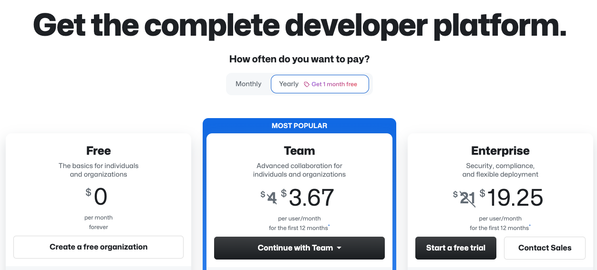

## Team vs. Enterprise

1. Team 라이센스 vs GitHub Enterprise 라이센스
  - [GitHub Pricing 페이지](https://github.com/pricing)  
    
   

2. 비교

  항목 | Team라이센스 | GitHub Enterprise라이센스 | 비고
  --|--|--|--
  [SAML SSO](https://docs.github.com/en/enterprise-cloud@latest/authentication/authenticating-with-saml-single-sign-on/about-authentication-with-saml-single-sign-on)로그인 | 미지원 | 지원
  [Azure AD/Okta와 Team sync](https://docs.github.com/en/enterprise-cloud@latest/organizations/managing-saml-single-sign-on-for-your-organization/managing-team-synchronization-for-your-organization) | 미지원 | 지원
  [LDAP](https://docs.github.com/en/enterprise-server@latest/admin/identity-and-access-management/using-ldap-for-enterprise-iam/using-ldap) | 미지원 | 지원 | GitHub Enterprise Server기능
  CI/CD munites/month | 3000분/월 | 50,000분/월 | 
  [Package](https://docs.github.com/en/enterprise-cloud@latest/packages) storage | 2GB | 50GB스토리지, 100GB data transfer out | 스토리지 사용량은 시간당 사용량으로 계산됨.([설명링크](https://docs.github.com/en/enterprise-cloud@latest/billing/managing-billing-for-github-packages/about-billing-for-github-packages)). 50GB를 넘는 추가 사용량은 하루에 $0.008USD/GB. Data transfer out은 $0.50USD/GB.
  GitHub Seucirty and compliance기능   - [Code Scanning](https://docs.github.com/en/enterprise-cloud@latest/code-security/code-scanning/introduction-to-code-scanning/about-code-scanning)   - [Secret Scanning](https://docs.github.com/en/enterprise-cloud@latest/code-security/secret-scanning/about-secret-scanning)   - [Dependency review](https://docs.github.com/en/enterprise-cloud@latest/code-security/supply-chain-security/understanding-your-software-supply-chain/about-dependency-review) | Public저장소만 가능 | 모든 저장소 타입가능(GitHub Advanced Security별도라이센스 필요)|
  [Merge Queue](https://docs.github.com/en/enterprise-cloud@latest/repositories/configuring-branches-and-merges-in-your-repository/configuring-pull-request-merges/managing-a-merge-queue) | 미지원 | 지원 | 
  [IP Allow list](https://docs.github.com/en/enterprise-cloud@latest/admin/configuration/hardening-security-for-your-enterprise/restricting-network-traffic-to-your-enterprise-with-an-ip-allow-list)설정 | 미지원 | 지원 | [Enterprise level](https://docs.github.com/en/enterprise-cloud@latest/admin/configuration/hardening-security-for-your-enterprise/restricting-network-traffic-to-your-enterprise-with-an-ip-allow-list#adding-an-allowed-ip-address), 혹은 [organization level](https://docs.github.com/en/enterprise-cloud@latest/admin/configuration/hardening-security-for-your-enterprise/restricting-network-traffic-to-your-enterprise-with-an-ip-allow-list#enabling-githubs-ip-allow-list)에서 설정 가능
  [Email notification](https://docs.github.com/en/enterprise-cloud@latest/admin/policies/enforcing-policies-for-your-enterprise/restricting-email-notifications-for-your-enterprise)을 회사도메인으로 제한 | 불가능 | 가능 | [Organization level](https://docs.github.com/en/enterprise-cloud@latest/organizations/keeping-your-organization-secure/managing-security-settings-for-your-organization/restricting-email-notifications-for-your-organization)에서도 설정 가능
  ['Internal' repository](https://docs.github.com/en/enterprise-cloud@latest/repositories/creating-and-managing-repositories/about-repositories#about-internal-repositories) | 미지원 | 지원 |
  [Org의 Public저장소 생성 제한](https://docs.github.com/en/enterprise-cloud@latest/admin/policies/enforcing-policies-for-your-enterprise/enforcing-repository-management-policies-in-your-enterprise#enforcing-a-policy-for-repository-creation) | 불가능 | 가능 | 멤버들의 저장소 생성 권한 제한
  [Org멤버들의 외부 Collaborator초대 제한](https://docs.github.com/en/enterprise-cloud@latest/admin/policies/enforcing-policies-for-your-enterprise/enforcing-repository-management-policies-in-your-enterprise#enforcing-a-policy-for-inviting-outside-collaborators-to-repositories) | 불가능 | 가능
  [Audig log API](https://docs.github.com/en/enterprise-cloud@latest/admin/monitoring-activity-in-your-enterprise/reviewing-audit-logs-for-your-enterprise/using-the-audit-log-api-for-your-enterprise) | 미지원 | 지원
  [Pre-received Hook](https://docs.github.com/en/enterprise-server@latest/admin/policies/enforcing-policy-with-pre-receive-hooks/creating-a-pre-receive-hook-environment) | 미지원 | 지원 | GitHub Enteprise Server기능
  [Premium, Premium+ Support](https://github.com/premium-support) | 미지원 | 지원 | GitHub 글로벌 Support팀의 기술지원 티켓에 대한 우선순위
  Invoice Billing | 미지원 | 지원 |