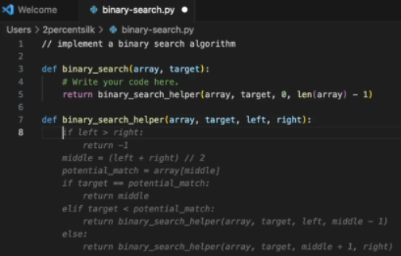

## Copilot Chat
- 개발자의 에디터에서 ChatGPT와 유사한 경험을 제공
- Generic questions : 일반적은 소프트웨어 관련 각종 질문들
- Generate unit tests : 코드 블럭 선택하여 유닛 테스트 생성
- Explain the code : 코드 블럭 선택하여, 코드 설명
- Propose a fix for bug : 버그 수정
  
  <video src="https://github.githubassets.com/assets/hero-lg-6a98e47708e8.mp4" width="700" height="450" controls> </video>

## Code 완성
- 코드 작성시, 자동완성 기능을 제공
- 커맨트(주석)를 코드로 변환
- 반복적인 패턴을 인식하여 자동완성
- 선택할 수 있는 여러가지 대안 코드를 제안해 주어, 개발자가 선택할 수 있도록 함
  

## Copilot for CLI
- 자주 잊기 쉬운 CLI 명령어들을, Copilot에서 질의하여, 필요한 CLI 명령어를 제안 받아 사용
- [GitHub Help 사용 설명서](https://docs.github.com/en/enterprise-cloud@latest/copilot/using-github-copilot/using-github-copilot-in-the-command-line)
- 3가지 쉘 커맨드 지원 
    - 일반적인 shell 명령어
    - Git CLI 명령어
    - GitHub의 CLI 명령어
- IDE의 GitHub Copilot 플러그인과 상관없이, '별도 CLI용 패키지' 설치 필요 ([설치관련 가이드](https://github.com/github/gh-copilot))

    <video src="./img/copilot-cli-v1-no-audio.mp4" width="700" height="450" controls> </video>

## GitHub Enterprise Web UI상에서 Document 
- GitHub Enterprise Cloud의 웹 UI상에서, 소스코드, 문서에 대한 검색
- Enterprise Cloud상에 존재하는 기업의 Private 저장소의 소스코드에 대한 질의 응답

  <video src="https://github.com/images/modules/site/copilot/features-breakout.mp4" width="700" height="450" controls> </video>

## Pull request 자동 summary
- Pull Request 작성시 기입하여야 하는 코맨트, 설명등을 Copilot이 자동으로 PR변경사항으로 작업
 <video src="./img/copilot-pr-summaries-v1-no-audio.mp4" width="700" height="450" controls> </video>

## Copilot Extensions

## Copilot Workspace

## Fine-tuned models
- Copilot이 제안하는 코드의 정확도를 높이기 위해, Fine-tuned model을 사용하여, 코드 제안의 정확도를 높임
- Fine-tuned model은 사용자의 코드 스타일, 프로젝트의 특성등을 반영하여, 코드 제안의 정확도를 높임
- 모델에 학습시킬 데이터(소스코드 저장소)는 <U> 반드시 GitHub Enterprise Cloud에 저장되어 있어야 함 </U>

