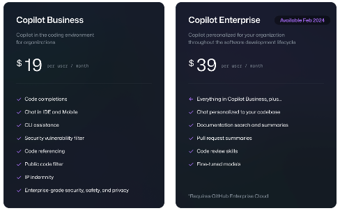

## GitHub Copilot Business 와 Copilot Enterprise 비교
- Copilot Business는 개발자들이 IDE상에서 Copilot Chat, Code완성, Copilot CLI등의 기능을 사용할 수 있습니다.
- Copilot Enterprise는 Copilot Business의 모든 기능을 제공하며, GitHub Enterprise 'Cloud'의 웹 UI 상에서 추가적인 Copilot 기능이 제공됩니다.

| 항목 | Copilot Business | Copilot Enterprise |
|:---:|:---:|:---:|
| GitHub Enterprise 라이센스 | 선택사항 | 반드시 필요함 |
| Copilot Chat | O | O |
| Code 완성 | O | O |
| Copilot CLI | O | O |
| GitHub Mobile 앱에서 Copilot기능 사용 | O | O |
| GitHub Enterprise Web UI상에서 Document search/summary | X | O |
| Pull request 자동 summary | X | O |
| Code review skills | X | O |
| Fine-tuned models | X | O |

  

