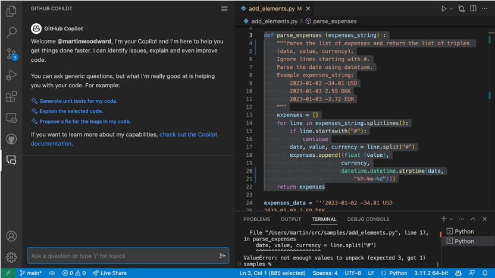
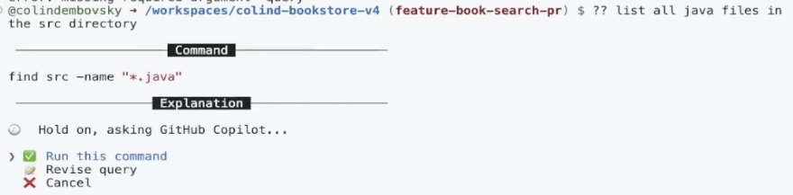
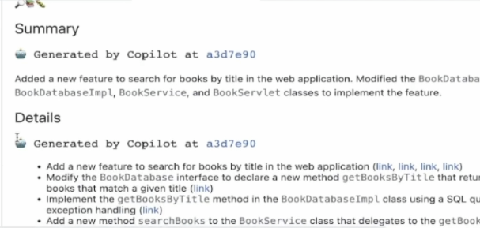

## GitHub Copilot Business 와 Copilot Enterprise 비교
- Copilot Business는 개발자들이 IDE상에서 Copilot Chat, Code완성, Copilot CLI등의 기능을 사용할 수 있습니다.
- Copilot Enterprise는 Copilot Business의 모든 기능을 제공하며, GitHub Enterprise 'Cloud'의 웹 UI 상에서 추가적인 Copilot 기능이 제공됩니다.

| 항목 | Copilot Business | Copilot Enterprise |
|:---:|:---:|:---:|
| GitHub Enterprise 라이센스 | 선택사항 | 반드시 필요함 |
| Copilot Chat | O | O |
| Code 완성 | O | O |
| Copilot CLI | O | O |
| GitHub Mobile 앱에서 Copilot기능 사용 | O | O |
| GitHub Enterprise Web UI상에서 Document search/summary | X | O |
| Pull request 자동 summary | X | O |
| Code review skills | X | O |
| Fine-tuned models | X | O |

  

## Copilot Chat
- 개발자의 에디터에서 ChatGPT와 유사한 경험을 제공
- Generic questions : 일반적은 소프트웨어 관련 각종 질문들
- Generate unit tests : 코드 블럭 선택하여 유닛 테스트 생성
- Explain the code : 코드 블럭 선택하여, 코드 설명
- Propose a fix for bug : 버그 수정
  

## Code 완성
- 코드 작성시, 자동완성 기능을 제공
- 커맨트(주석)를 코드로 변환
- 반복적인 패턴을 인식하여 자동완성
- 선택할 수 있는 여러가지 대안 코드를 제안해 주어, 개발자가 선택할 수 있도록 함

## Copilot for CLI
- 자주 잊기 쉬운 CLI 명령어들을, Copilot에서 질의하여, 필요한 CLI 명령어를 제안 받아 사용
- 3가지 쉘 커맨드 지원 
    - ?? : General CLI
    - git? : Git specific CLI
    - gh? : GitHub specific CLI

    

## GitHub Enterprise Web UI상에서 Document search/summary
- GitHub Enterprise Cloud의 웹 UI상에서, Document search/summary 기능을 제공

## Pull request 자동 summary
- Pull Request 작성시 기입하여야 하는 코맨트, 설명등을 Copilot이 자동으로 PR변경사항으로 작업

## Code review skills
- Pull Request에서 코드 리뷰시, Copilot이 코드 리뷰를 도와주는 기능

## Fine-tuned models
- Copilot이 제안하는 코드의 정확도를 높이기 위해, Fine-tuned model을 사용하여, 코드 제안의 정확도를 높임
- Fine-tuned model은 사용자의 코드 스타일, 프로젝트의 특성등을 반영하여, 코드 제안의 정확도를 높임
- 모델에 학습시킬 데이터(소스코드 저장소)는 반드시 GitHub Enterprise Cloud에 저장되어 있어야 함

