 
# GitHub Copilot Standalone 설정방법 (with Entra ID : OIDC SSO)

## **Prerequisites**

Copilot Standalone의 사용을 위해서는 아래 2가지 조건이 필요합니다. 

1. _Azure 구독 ID_
2. _Entra ID (P1라이센스 이상)_

- Azure 구독 ID를 통해 Copilot Standalone의 월별 비용이 결재됩니다.
- Entra ID를 통해 사용자가 auto-provisioning되며, 사용자들이 최초 로그인 시에는 Entra ID의 SSO를 통해 인증됩니다.

** Note: ** Entra ID의 'Free' 라이센스도 가능하지만, 이 경우 아래와 같은 ** 제약 사항 ** 이 있습니다. Entra ID의 P1라이센스 이상을 사용하시면 아래 기능을 사용할 수 있습니다. ([Entra ID의 라이센스별 기능 차이 설명 참조](https://www.microsoft.com/en-us/security/business/microsoft-entra-pricing))

* Conditional Access Policy를 사용할 수 없음
* Group provisioning을 사용할 수 없음

 

## **설정 순서**
Copilot Standalone의 설정은 아래와 같은 순서로 진행됩니다.  

1. GitHub으로 부터 받은 관리자 초대 이메일의 버튼 클릭하여 ‘관리자 패스워드' 설정
2. Configure SAML SSO / SCIM for GitHub Enterprise
3. Azure 구독 ID 등록
4. Copilot 활성화 
5. Team 구성 및 Copilot Business 라이센스 할당
6. 사용자의 GitHub Copilot Extension 설치 및 로그인

 

## **[1] 관리자 초대 메일을 통해 ‘관리자 패스워드’ 설정**

 

GitHub에서 Copilot Standalone을 위한, GitHub.com 클라우드 상의 ‘관리 페이지'가 설정되면, 사전에 전달해 주셨던 관리자 이메일로 아래와 같은 초대 이메일이 전송됩니다. 

 ** 주의: **  반드시 브라우저의  ‘시크릿 페이지' 혹은, 별도의 브라우저 어플리케이션을 통해 패스워드를 설정  해 주시기 바랍니다. (기존에 열려 있던 브라우저상에 GitHub.com으로의 다른 세션이 있다면, 이 세션으로 인해 문제가 발생합니다)

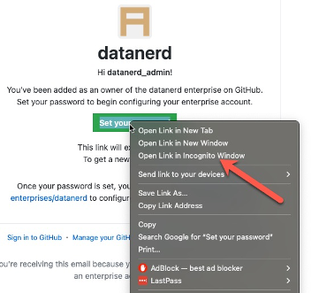

 ** !! 주의 !! ** 

** 설정해 주신 패스워드와, 패스워드 설정시에 나오는 **Recovery 코드**_는 꼭 잘 저장하셔서, 분실되지 않도록 잘 관리 되어야 합니다. 

** GitHub 상의 관리페이지는 <code>https://github.com/enterprises/</code><code>&lt;your enterprise name></code>

입니다. 이 URL은 최초 패스워드 설정하고 로그인되었던 화면의 페이지 URL입니다. 관리 페이지 주소를 분실하지 않도록 잘 관리 되어야 합니다. 

** 관리페이지 URL의 <code>&lt;your enterprise name> : </code> 이 부분은 Copilot Standalone ‘신청폼’에 기입해 주셨던 ‘<strong>Short code</strong>’ 입니다. 이후 이 short code가, 아래 2번 SSO 설정과 Auto-provionsing 설정에서 ‘기업코드’로 사용됩니다. 

 

## **[2] SAML SSO 와 SCIM 설정 **

사용자 추가를 위해 EntraID와의 SAML SSO 설정 및 SCIM(Auto provisioning기능) 설정이 필요합니다. 

 ** 이 작업을 위해서는 Azure EntraID의 관리자 계정이 필요합니다.  

(아래는 GitHub Help, [Microsoft Entra ID SSO - GitHub Enterprise Managed User 설정 가이드](https://learn.microsoft.com/en-us/entra/identity/saas-apps/github-enterprise-managed-user-tutorial)의 페이지의 설정 순서를 요약한 것입니다. 상세한 내용은 각 설명 페이지의 내용을 참조 하시기 바랍니다)

### 2-1. Entra ID 에서 설정

1. Entra ID 내에 ‘[GitHub Enterprise Managed User](https://azuremarketplace.microsoft.com/en-us/marketplace/apps/aad.githubenterprisemanageduser?tab=Overview)’ 어플리케이션을 설치합니다 
2. 위 설치된 GitHub Enterprise Managed User 어플리케이션에 대한 SAML SSO 를 설정합니다.
설정시 필요한 값들은 아래와 같이 설정됩니다
 
   - 아래 `<short code>` 값은 신청폼에 기입해 주신 short code 값이며, 위 1번 과정에서 관리자 로그인시 나타나는 `<your enterprise>`</code>` 입니다.
   - Identifier : https://github.com/enterprises/`<short code>`
   - Reply URL : https://github.com/enterprises/`<short code>`/saml/consume
   - Sign-on URL : https://github.com/enterprises/`<short code>`/sso
 
3. Certificate 을 PEM 포맷으로 다운로드 합니다.
4. Login URL, Entra ID Identifier 값을 Copy 하여 놓습니다. (이 값들은 이후, GitHub 상의 SSO 설정에 추가되는 값들입니다)
5. 관리자를 추가 합니다. 이 때 추가되는 관리자는 GitHub 관리자의 계정(최초 관리자 패스워드 설정을 하신 관리자분)을 추가합니다.  이 관리자 계정은 아래 <2> 과정의 5)번 과정에서 에서 Test SAML Configuration 시에 로그인을 위해 필요합니다. 

   * ‘사용자 및 그룹’ 메뉴에서 ‘+사용자/그룹 추가’ 선택 

     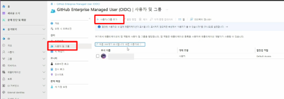

   * 왼편의 ‘할당추가’에서 ‘사용자 및 그룹’ 선택

        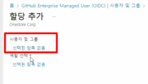

   * 사용자 및 그룹에서 추가할 사용자 검색

        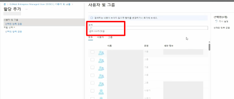  

   * 검색된 사용자 선택
        

        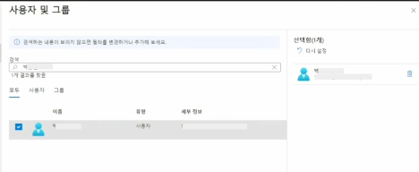
    

   * 왼편의 ‘할당추가’에서 ‘역할 선택’ 
        

        
        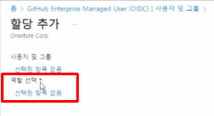
    

   * 역할 선택 메뉴에서 ‘Enterprise Owner’ 혹은 ‘User’ 선택 하고, 하단에 ‘선택’ 클릭

        - 먼저 GitHub 관리자를 추가하고, **'Enterprise owner’** 로 설정

        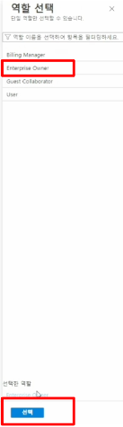

   * 왼편의 ‘할당 추가’ 하단의 ‘할당’ 클릭

        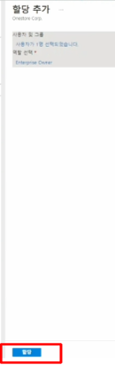

   * 할당된 사용자 확인 (우측에 ‘할당된 역할’: ‘Enterprise Owner’)

        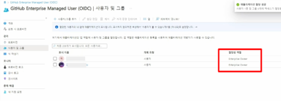
 

### 2-2. GitHub 관리페이지에서 설정

1. GitHub 관리 페이지로 이동합니다.
2. 왼편의 Settings > Authentication security 메뉴로 이동합니다.
3. Require SAML authentication’ 체크박스 설정
4. 위 EntraID 에서 저장된 값들을 설정합니다.
   - Entra ID Login URL → Sign on URL
   - Entra ID Identifier → Issuer
   - Certificate PEM 파일의 내용을 복사하여 ‘Pubic certificate’에 붙여 넣기
5. ‘Test SAML configuration’ : 위에 5) 과정에서 추가된 관리자 계정으로 Entra ID 에 로그인 합니다.
6. Test 가 완료되면 반드시 ** ‘Save’ 버튼을 클릭하여 설정을 저장 ** 합니다.

 

### 2-3. Entra ID에서 SCIM 설정 : [Entra ID 설정 가이드](https://learn.microsoft.com/en-us/entra/identity/saas-apps/github-enterprise-managed-user-provisioning-tutorial)

1. GitHub 관리자 계정의 Personal access token을 생성합니다. ([Personal access token 생성방법](https://docs.github.com/en/enterprise-cloud@latest/admin/identity-and-access-management/provisioning-user-accounts-for-enterprise-managed-users/configuring-scim-provisioning-for-enterprise-managed-users#creating-a-personal-access-token))
2. Entra ID 설정 페이지로 이동합니다. 
3. GitHub Enterprise Managed User OIDC 어플리케이션에 대한 ‘Provisioning’을 ‘Automatic’으로 설정
    1. Tenant URL 값 : https://api.github.com/scim/v2/enterprises/`<short code>`
    2. Secret Token은 위 1)에서 설정한 GitHub 관리자의 Personal Access Token 값을 입력합니다. 
    3. Test Connection 실행
4. ‘Provisioning Status’를 ‘On’으로 설정합니다.
5. Scope을 설정합니다. 
6. GitHub Copilot을 사용할 사용자를 추가합니다. (Select a role 메뉴에서 ‘user’로 설정)
   - 위 “<1> Entra ID 에서 설정”의 5)관리자 추가 항목의 순서를 따라 설정합니다. 
   - 단, ‘역할 선택’에서 ‘User’를 선택합니다. 
    
     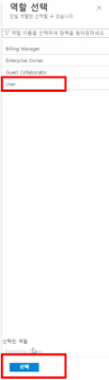
   
7. GitHub 관리 페이지의 ‘People’ 메뉴에서 사용자들이 Provisioning 되는 것을 확인합니다. (Entra ID의 경우 Sync까지 시간이 소요됩니다. (수동으로 바로 provisioning하는 버튼을 통해 사용자를 GitHub으로 provisioning합니다). 

    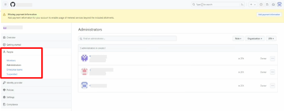

 

### **[3] Azure 구독 ID 등록**

 

GitHub 관리 페이지의 Billing & Licensing > Payment Information 메뉴에서 Azure 구독 ID를 등록 합니다. 

* 버튼을 누르면, Azure 구독 ID 관리자 계정으로 로그인 하여, Azure 구독을 등록하게 됩니다. 

    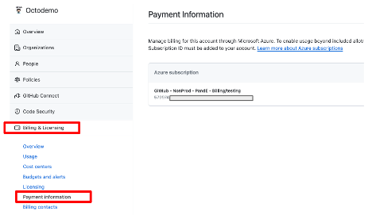

 

### **[4] Copilot 활성화 **

GitHub 관리 페이지의 **Policies>Copilot** 메뉴에서 Copilot 기능을 활성화 합니다.  

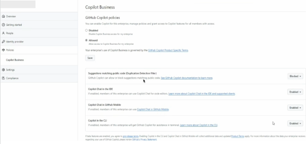 

* **Suggestions matching public code**

    Copilot이 제안해 주는 코드 블럭과 개발자의 코드가 합쳐졌을 때 150캐릭터 이상이 오픈소스와   유사할 경우, 이러한 코드를 제안 받지 않도록 설정 
     
* **Copilot Chat in the IDE**

    Copilot Chat기능의 활성화 여부
 
* **Copilot Chat in GitHub Mobile**

    Copilot Chat기능을 GitHub 모바일 어플리케이션 (안드로이드, IOS)에서의 사용여부
 
* **Copilot in the CLI**

    Copilot CLI기능의 활성화 여부

 

### **[5] Team 구성 및 Copilot Business 라이센스 할당**

 ** !! 주의 !! **  아래의 과정으로 Copilot Business 라이센스를 할당하시면, 할당 하는 당일 부터 비용이 발생하여, Azure 구독 ID로 결제됩니다. (사용자의 실제 사용 여부와 관련 없이, ** 관리자가 라이센스를 할당하는 날짜부터 비용이 부과  ** 됩니다)

 ** !! 주의 !! ** 관리자가 Copilot Business 라이센스를 할당하면, 사용자는 **약 30분 뒤** 부터 사용이 가능합니다. 

1. GitHub 관리 페이지의 ‘People > Enterprise teams’ 메뉴에서 ‘New enterprise team’ 버튼을 클릭하여 사용자들로 구성된 team을 생성합니다. 

    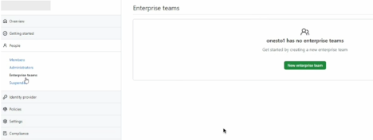

    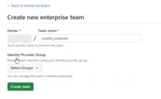

2. Team 생성 후, ‘Add a member’를 통해 사용자를 team에 추가합니다. 
3. Settings > Enterprise licensing 메뉴의 오른편에 Copilot Business ‘Manage seats’ 버튼 을 클릭
4. ‘Start adding teams’ 버튼 클릭 후, 위에서 생성된 team 선택

 
  

### **[6] 사용자의 GitHub Copilot Extension 설치 및 로그인**

GitHub Copilot은 Visual Studio, VS Code, JetBrains IDE과 Neovim을 지원 합니다. 아래는 VS Code에 대한 예제 입니다. 

* GitHub Help 문서에 보시면 각 IDE에 대한 설치와 사용 가이드가 있습니다. 
* [Install Copilot extension](https://docs.github.com/en/enterprise-cloud@latest/copilot/configuring-github-copilot/installing-the-github-copilot-extension-in-your-environment)
* [Copilot in your environment](https://docs.github.com/en/enterprise-cloud@latest/copilot/configuring-github-copilot/configuring-github-copilot-in-your-environment)
1. 관리자에 의해 Copilot Business 라이센스가 부여되면 사용자는 아래와 같은 이메일을 수신합니다. 

    
    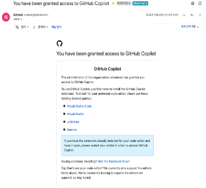

2. Copilot의 사용을 위해 ‘GitHub Copilot’과 ‘GitHub Copilot Chat’ 두가지 플러그인을 Visual Studio Code에 설치합니다. 

    
    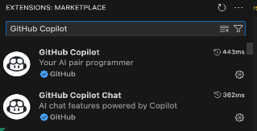

3. 플러그인 설치 후, Copilot 아이콘을 클릭하면, 브라우저를 통해 GitHub.com의 계정으로 로그인하게 됩니다. 

    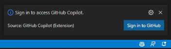

     ** !! 주의 !! ** 기존에 다른 계정으로 로그인되어 있다면, 해당 계정에서 로그아웃하고, Copilot Business 라이센스가 부여된 회사 계정으로 로그인 하여야 합니다. 

     ** !! 주의 !! **  사용자들이 브라우저에서 로그인 시, ID 부분에 사용자 이메일이 아닌, 아래 화면 캡쳐와 같이 **‘short code'** 를 입력하고, ‘Sign in with your identity provider’  버튼을 눌러, 회사의 Entra ID로 로그인 해야 합니다. ‘short code'는 기업관리자 페이지의 ‘your-enterprise-name’ 부분입니다.

    **예) short code가 ‘fabrikam’ 이라면 앞에 ‘_’를 덧붙여 ‘_fabrikam’을 입력**

    

4. 로그인 후, 아래와 같이 사용할 VS Code를 ‘Authorize’ 해 줍니다. 
    
        
    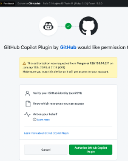