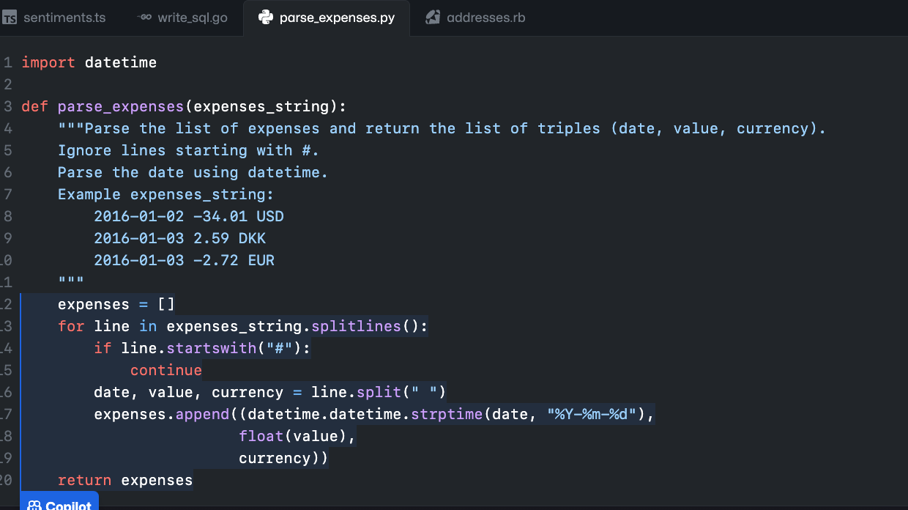
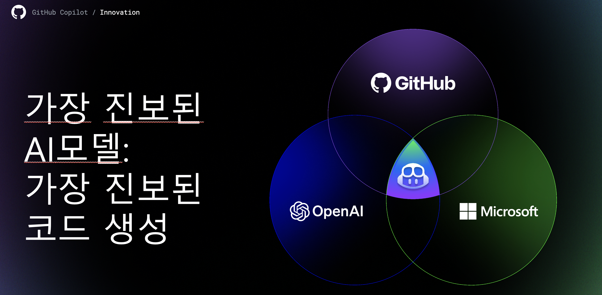
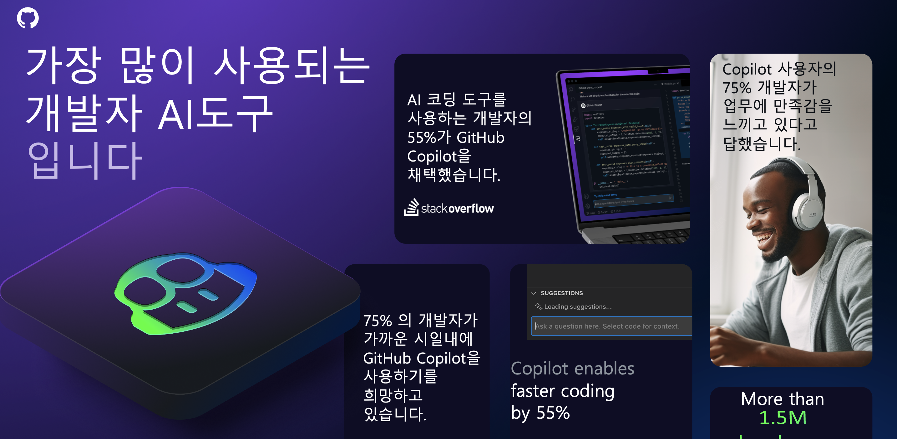
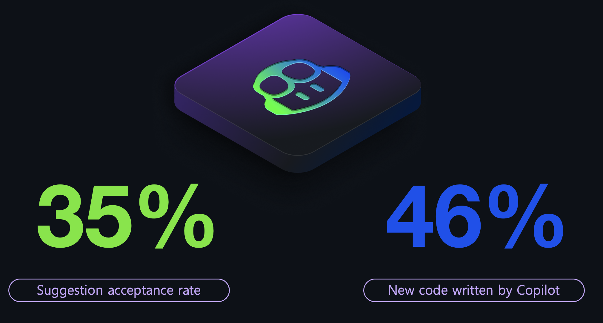
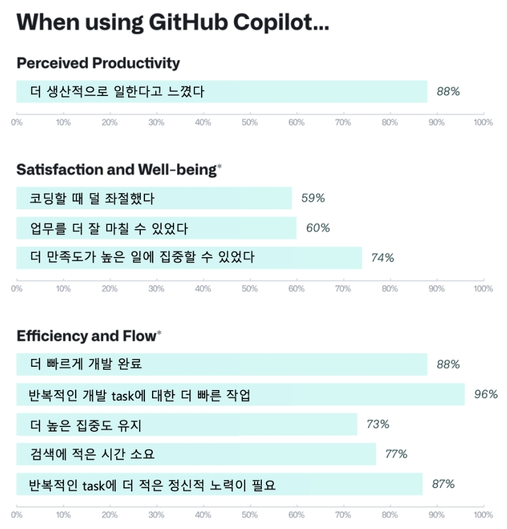
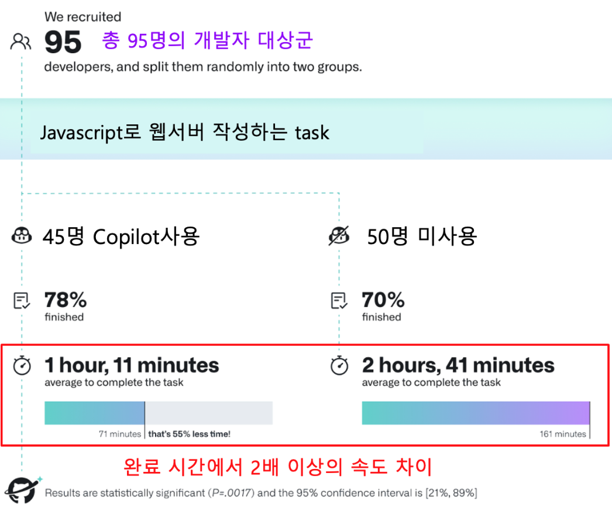

## [GitHub Copilot](https://github.com/features/copilot/)
- GitHub Copilot은 개발자 여러분들을 위한 AI 페어 프로그래머 입니다.
- GitHub Copilot은 개발자 여러분을께 코드를 제안해 줍니다. 

- ** 가장 진보된 생성형 AI모델을 사용 ** 하여, 가장 유용한 코드를 제안해 줍니다.

- 가장 많이 사용되는 생성형 AI기반 개발자 도구 입니다. 

- 가장 많은 엔터프라이즈 기업에서 사용하는 AI기반 개발자 도구 입니다.

## Copilot의 주요기능
- GitHub Copilot은 아래와 같은 기능들이 있습니다. ([기능설명 페이지 참조](./01.Copilot-features.md))
    - Copilot Chat
    - Code 완성
    - Copilot for CLI
    - GitHub Enterprise Web UI상에서 Document
    - Pull request 자동 summary
    - Copilot Extensions
    - Copilot Workspace
    - Fine-tuned models

## GitHub Copilot 라이센스
- GitHub Copilot은 '개인용'과 '기업용'라이센스가 있습니다. 
- 기업용 라이센스는 'Copilot Business'와 'Copilot Enterprise'로 나뉩니다. 
    - Copilot Business는 개발자들이 IDE상에서 Copilot Chat, Code완성, Copilot CLI등의 기능을 사용할 수 있습니다.
    - Copilot Enterprise는 Copilot Business의 모든 기능을 제공하며, GitHub Enterprise 'Cloud'의 웹 UI 상에서 추가적인 Copilot 기능이 제공됩니다.
    - Copilot Business와 Copilot Enterprise의 차이는 [Copilot Business vs Copilot Enterprise](./02.Copilot-license-comparison.md)참조
- 개인용은 각 개인이 GitHub.com의 개인 계정에서 구매할 수 있습니다. 
- 기업용은 엔터프라이즈 기업욜 위한 '보안'이 강화되어 있습니다. ([Copilot for Business의 보안](./02.cfb-security.md)참조)
- Copilot은 기본적으로 __월별 사용량 기반으로 결제__ 되는 구조 입니다. 
    - '사용량'은 Copilot을 사용하도록 할당된 '개발자 수' 입니다. 
    - Copilot for Business의 라이센스 사용량 확인은 [GitHub Enterprise에서 Copilot for Business시작하기](./01.GHE-start-cfb.md)참조

## GitHub Copilot 기업용 라이센스 구매 방법 
  - GitHub Copilot 기업용 라이센스 구매방법은 [GitHub 라이센스, Copilot 구매방법](../Ch1.GitHub이란/GitHub라이센스,%20Copilot%20구매방법.html)을 참조하세요.

   

## Copilot 기업 고객 라이센스는 높은 수준의 보안을 제공합니다.
- Copilot 기업용 라이센스는 엔터프라이즈 기업의 코드를 default로 모두 폐기합니다. 
- 기업의 코드를 저장하거나, 학습에 이용하지 않습니다.
- Copilot 기업용 라이센스의 보안에 대한 자세한 내용은 [Copilot for Business의 보안](./02.cfb-security.md)를 참조하세요.

## GitHub Copilot의 효과
- Copilot은 개발자 분들의 생산성 증진과, 혁신에 대한 가속화 그리고 새로운 기술을 빠르게 습득하는데에도 큰 도움을 줍니다. 
- [Youtube: Copilot for Business - Interview with Jamon Holmgreen, Founder/CTO at InfiniteRed](https://youtu.be/SWvS2A5vBmA)
- 평균 35%의 승인률을 보이고 있습니다.(Copilot이 제안한 코드를 사용하는 비율)
  

- [GitHub의 자체적인 설문조사](https://github.blog/2022-09-07-research-quantifying-github-copilots-impact-on-developer-productivity-and-happiness/
) 결과 많은 수의 개발자 분들이 '더 생산적으로 일한다', '높은 집중도를 유지', '반복적인 task'에 큰 도움이 되었다고 응답했습니다. 

- 총 95명의 개발자들을 대상으로, Javascript로 웹서버를 작성하는 task를 주고, 45명은 Copilot을 사용하고, 나머지 50명은 사용하지 않게 하여 [비교 시험](https://github.blog/2022-09-07-research-quantifying-github-copilots-impact-on-developer-productivity-and-happiness/#figure-summary-of-the-experiment-process-and-results)을 했습니다. 그 결과, 완료 시간에서 2배이상의 차이가 나는 것을 알 수 있었습니다.

### [* 링크: Copilot Specific Terms](https://github.com/customer-terms/github-copilot-product-specific-terms)