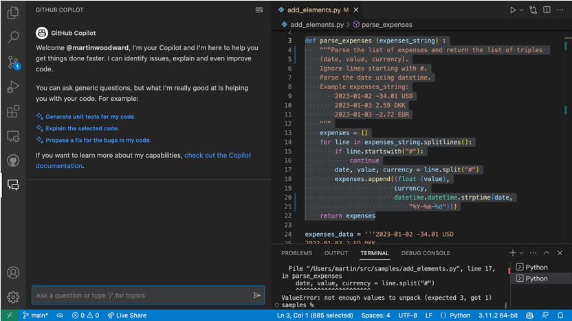
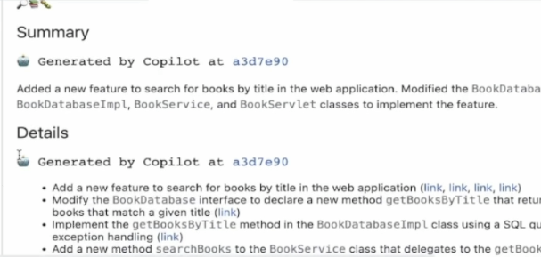
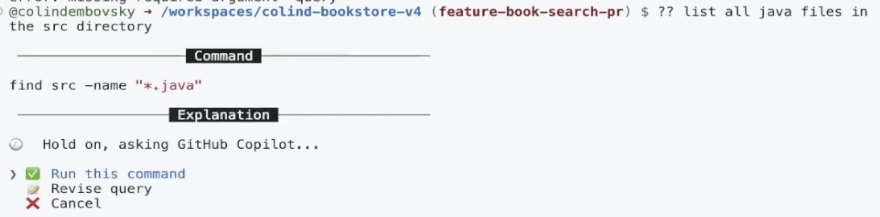

## GitHub Copilot X 
- the future of AI-powered software development : [GitHub Blog링크](https://github.blog/2023-03-22-github-copilot-x-the-ai-powered-developer-experience/)
- Copilot X는 GitHub Copilot의 차세대 발전 계획입니다. (특정 제품명이나 라이센스는 아닙니다)
- 현재 Private preview상태로, 개별적으로 wait list에 등록할 수 있습니다. 
- wait list 등록은 [GitHub Blog 페이지](https://github.blog/2023-03-22-github-copilot-x-the-ai-powered-developer-experience/)에서 Copilot X의 개별적인 각 기능별로 하실 수 있습니다. 

## GitHub Copilot X의 기능들
- Copilot Chat
- Copilot Pull Request
- Copilot Docs
- Copilot CLI
- 데모영상 : [Copilot 데모영상](./04.CopilotDemoclips.md) 페이지 참조

## Copilot Chat
- 개발자의 에디터에서 ChatGPT와 유사한 경험을 제공
- Generic questions : 일반적은 소프트웨어 관련 각종 질문들
- Generate unit tests : 코드 블럭 선택하여 유닛 테스트 생성
- Explain the code : 코드 블럭 선택하여, 코드 설명
- Propose a fix for bug : 버그 수정

## Copilot for Pull requests
- Pull Request 작성시 기입하여야 하는 코맨트, 설명등을 Copilot이 자동으로 PR변경사항으로 작업

## Copilot for Docs
- 개발자들이 자주 참조하는 기술 문서들을 Copilot이 학습하고, Chat과 같은 인터페이스에서 개발자들이 질문하고 답변을 받을 수 있는 기능
- 초기 지원 기술 문서
    - GitHub
    - React
    - Azure
    - MDN
- 향후, 엔터프라이즈의 내부 문서들도 지원할 예정

## Copilot for CLI
- 자주 잊기 쉬운 CLI 명령어들을, Copilot에서 질의하여, 필요한 CLI 명령어를 제안 받아 사용
- 3가지 쉘 커맨드 지원 
    - ?? : General CLI
    - git? : Git specific CLI
    - gh? : GitHub specific CLI

    