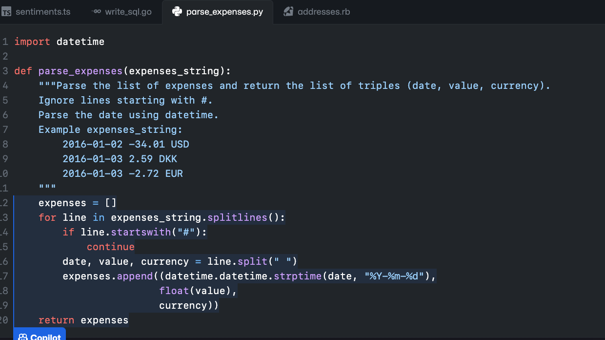
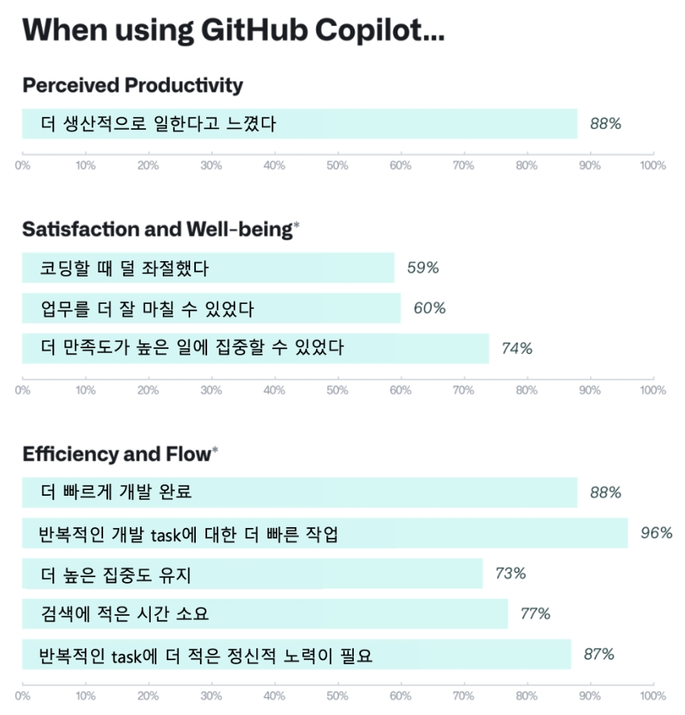
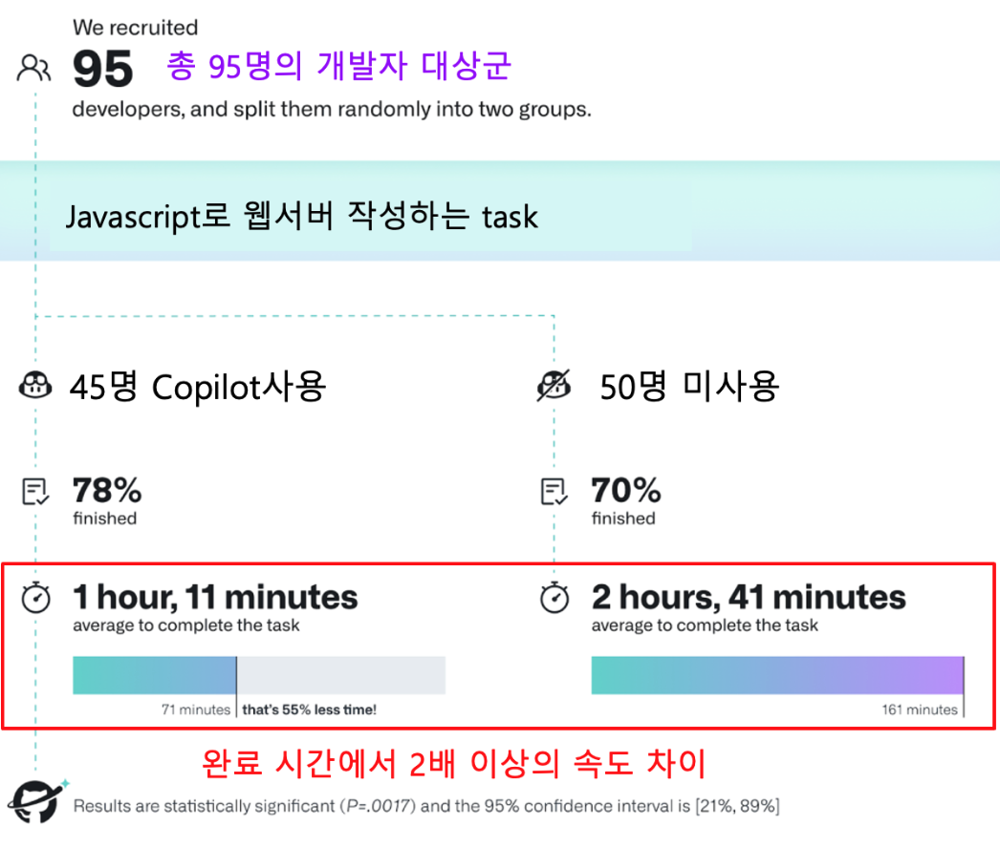
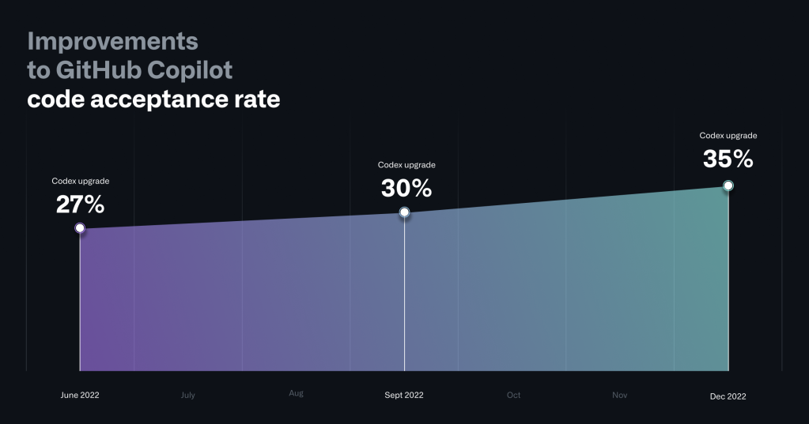

## [GitHub Copilot](https://github.com/features/copilot/)
- GitHub Copilot은 개발자 여러분들을 위한 AI 페어 프로그래머 입니다.
- GitHub Copilot은 개발자 여러분을께 코드를 제안해 줍니다. 
- Copilot은 커맨트를 코드로 변환해 주며, 반복적인 패턴을 잘 인식하고 자동완성을 해 줍니다. 

## GitHub Copilot 라이센스
- GitHub Copilot은 '개인용'과 '기업용'라이센스가 있습니다. 
- 개인용은 각 개인이 GitHub.com의 개인 계정에서 구매할 수 있습니다. 
- 기업용은 엔터프라이즈 기업욜 위한 '보안'이 강화되어 있습니다. ([Copilot for Business의 보안](03.cfb-security.md)참조)
- Copilot은 기본적으로 _월별 사용량 기반으로 결제_되는 구조 입니다. 
    - '사용량'은 Copilot을 사용하도록 할당된 '개발자 수' 입니다. 
    - Copilot for Business의 라이센스 사용량 확인은 [GitHub Enterprise에서 Copilot for Business시작하기](./01.GHE-start-cfb.md)참조

## GitHub Copilot의 효과
- Copilot은 개발자 분들의 생산성 증진과, 혁신에 대한 가속화 그리고 새로운 기술을 빠르게 습득하는데에도 큰 도움을 줍니다. 
- [Youtube: Copilot for Business - Interview with Jamon Holmgreen, Founder/CTO at InfiniteRed](https://youtu.be/SWvS2A5vBmA)

- [GitHub의 자체적인 설문조사](https://github.blog/2022-09-07-research-quantifying-github-copilots-impact-on-developer-productivity-and-happiness/
) 결과 많은 수의 개발자 분들이 '더 생산적으로 일한다', '높은 집중도를 유지', '반복적인 task'에 큰 도움이 되었다고 응답했습니다. 

- 총 95명의 개발자들을 대상으로, Javascript로 웹서버를 작성하는 task를 주고, 45명은 Copilot을 사용하고, 나머지 50명은 사용하지 않게 하여 [비교 시험](https://github.blog/2022-09-07-research-quantifying-github-copilots-impact-on-developer-productivity-and-happiness/#figure-summary-of-the-experiment-process-and-results)을 했습니다. 그 결과, 완료 시간에서 2배이상의 차이가 나는 것을 알 수 있었습니다.

- Copilot이 제안한 코드를 얼마나 많이 사용하는지를 보여주는 ['Code acceptance rate'도 꾸준히 증가하고 있습니다.](https://github.blog/2023-02-14-github-copilot-now-has-a-better-ai-model-and-new-capabilities/#a-more-powerful-ai-model-and-better-code-suggestions) ('23.2월기준 전체 평균 46%, Java 61%)

#### [* 링크: Copilot Specific Terms](https://github.com/customer-terms/github-copilot-product-specific-terms)