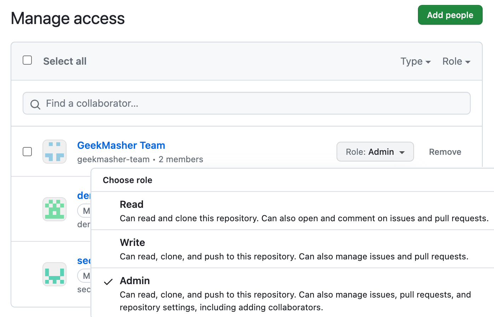
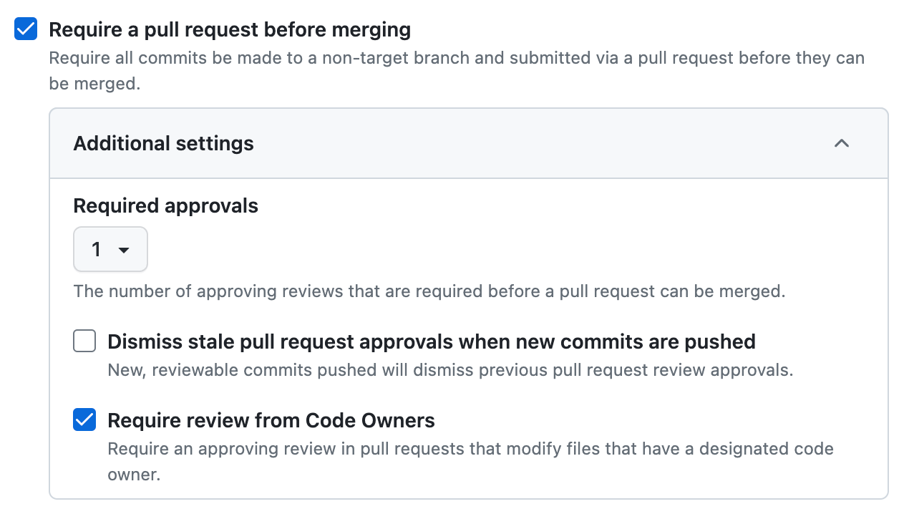
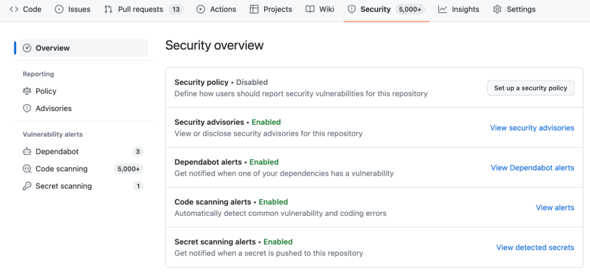
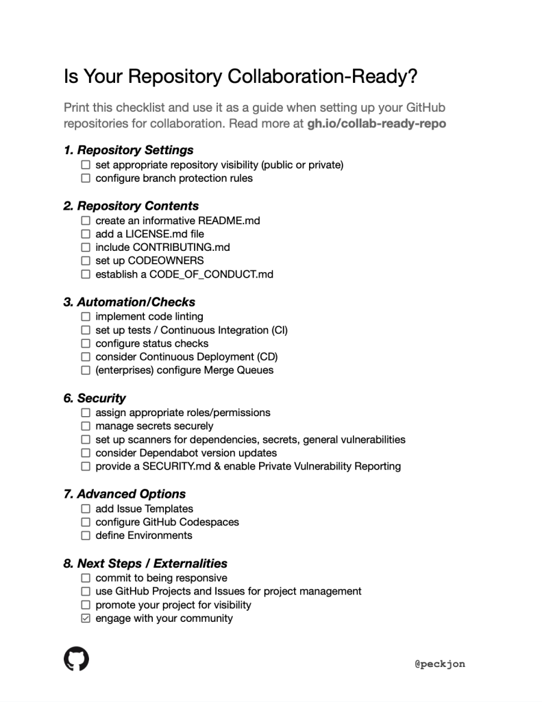

# **리포지토리 협업 준비를 위한 체크리스트 및 가이드**

원본 링크: https://github.blog/2023-08-04-a-checklist-and-guide-to-get-your-repository-collaboration-ready/

제 딸에게는 애완용 저빌(주: 애완용 게르빌루스 쥐)한 쌍이 있습니다. 아주 멋진 애완용 쥐 이지만, 기르기에 그다지 까다롭지는 않습니다. 필요한 것이라고는, 종종 우리를 청소해주고, 음식과 물을 보충해야 하며, 잠시 자리를 비우면 이웃에게 부탁해 돌봐줄 것을 부탁해야 하는 것입니다. 하지만 언젠가 제 딸은 고양이나 개와 같이 매일 놀아주고 더 많은 보살핌과 관심을 필요로 하는 애완동물을 갖게 될 수 있습니다. 이때는, 그녀가 없을 때 애완동물을 돌봐 줄 좋은 친구들 몇 명이 필요하고, 그리고 훗날 언젠가 그녀가 자신의 아이를 갖게 되었을 때, 지역사회 커뮤니티와 가족의 도움은 더욱 중요합니다. 예전 속담에 '한 아이를 키우는 데 온 마을이 필요하다'라는 말 처럼 말이죠.

코드 프로젝트도 이와 동일합니다. 동료들과 저는 종종 우리 프로젝트를 "애완동물" 또는 심지어 "어린이"라고 부릅니다(때로는 농담으로, 때로는 강박적으로). 우리는 그들에게 많은 관심과 관심을 기울이지만 커뮤니티의 기여가 그들의 성공에 얼마나 중요한지를 잊기 쉽습니다. 소프트웨어 개발의 세계에서 협업은 불안정한 마지막 릴리스와 안정적이고 유지 관리가 가능하며 고통 없는 프로젝트 사이의 차이를 만들 수 있습니다. 하루 동안 코딩을 했는지, 10년 동안 코딩을 했는지에 관계없이 동료가 여러분을 도와 여러분이 작업한 것을 더욱 견고하게 만들어 줍니다. 이것을 위해서는 동료와 함께 협력할 수 있는 도구가 필수적으로 필요합니다.

리포지토리의 생성자 또는 유지 관리자로서의 주요 책임은 다른 사람들이 프로젝트를 적절하게 사용하고 이해하며 기여할 수 있도록 하는 것입니다. GitHub은 이것을 지원하기 위해 존재하지만 리포지토리가 협업 준비가 되도록 하려면 `git clone`을 사용하는 것보다는 좀 더 많은 노력이 필요합니다. 이번글에서는 협업을 구성하기 위해 필요한 설정, 콘텐츠 및 동작을 설명합니다.

## **1.**  **저장소 설정**

[저장소 설정](https://docs.github.com/repositories/managing-your-repositorys-settings-and-features)은 협업의 기반을 마련합니다. 그들은 프로젝트를 보고 기여할 수 있는 사람, 기여된 내용이 어떻게 검토되는지, 그리고 제출된 기여에 어떤 일이 발생하는지 결정합니다. 적절하게 사용하면 전 세계 기여자들이 프로젝트를 찾고, 사용하고, 구축하는데 도움을 줄 수 있는 환경을 조성할 수 있습니다. 기업 환경에서 이들은 개발자가 사일로화된 사고 및 구축 방식에서 "검색 우선, 공동 작업 우선" 사고 방식으로 전환하는데 도움이 됩니다. [이너 소싱](https://gh.io/innersource)으로 잘 알려진 이러한 실천법은, 중복 작업을 줄이고 회사 전체를 가속화합니다.

### **Visibility**

기여와 재사용을 최대화하는 것을 목표로 하지만 이것이 항상 저장소를 공개하는 것을 의미하지는 않습니다. 특히 정보 프라이버시가 고려되는 기업 환경에서는 더욱 그렇습니다. 리포지토리의 "설정" 탭에서 사용할 수 있는 몇 가지 옵션이 있습니다.

- **Public** 저장소는 통해 전 세계 모든 사람이 코드를 보고 복사할 수 있으며 일반적으로 issues 와 pull request 를 생성할 수 있으므로 잘 작동하는지에 대한 피드백을 제공하거나 개선을 위한 변경 사항을 제안할 수 있습니다(강요는 아님). 이것은 일반적으로 보호되어야 할 정보가 포함되지 않은 개인 프로젝트에 적합합니다 (토큰들은 모두 [별도로 보관](https://docs.github.com/actions/security-guides/encrypted-secrets) 해야 합니다) 혹은 특정 "축복받은" (퍼블릭이 가능한) 회사 프로젝트에만 해당됩니다.
- **Internal** 저장소는 [깃허브 엔터프라이즈](https://github.com/enterprise)에서 사용되는 [특별한 가시성 수준](https://docs.github.com/enterprise-cloud@latest/repositories/managing-your-repositorys-settings-and-features/managing-repository-settings/setting-repository-visibility#making-a-repository-internal) 입니다. 조직 내부의 모든 사람이 리포지토리를 볼 수 있지만 외부 세계의 사람은 볼 수 없습니다. Internal 저장소는 일반적으로 사일로화된 민감한 정보(예: 특정 그룹만 알아야 하는 고객별 데이터 또는 논리)가 없는 회사 프로젝트의 기본 수준으로 제안합니다.
- **Private** 저장소는 가장 제한적인 옵션이며 공동 작업을 방해할 수 있습니다. 이 옵션은 드물게 사용하고, 사용하는 경우 일부 공동 작업자를 초대해야 합니다.
- **협력자** 는 당신의 프로젝트에 [참여하도록 초대](https://docs.github.com/account-and-profile/setting-up-and-managing-your-personal-account-on-github/managing-access-to-your-personal-repositories/inviting-collaborators-to-a-personal-repository)된 특정 개인 또는 팀입니다. 그들의 [역할](https://docs.github.com/organizations/managing-peoples-access-to-your-organization-with-roles/roles-in-an-organization)은 "읽기"(Private 리포지토리를 볼 수 있음), "쓰기"(직접 커밋하거나 pull request를 실행할 수 있음), "관리자" 등 구체적으로 주어질 수 있습니다.

### **메인 브랜치 보호**

프로젝트를 보고 기여할 수 있는 사람들의 수를 최대화하고 싶지만 핵심 팀 구성원과 자동화를 통해 그들의 기여를 적절하게 검토해야 합니다. 대부분의 경우 메인 브랜치에 대한 [repository rule](https://github.blog/2023-07-24-github-repository-rules-are-now-generally-available/) ([branch protection](https://docs.github.com/repositories/configuring-branches-and-merges-in-your-repository/managing-protected-branches)기능에 대한 최신의 대체기능)을 구성하여, 메인 브랜치에 병합을 위해서는 pull request가 반드시 필요하도록 구성하십시오. 최소 한 명의 승인자, 이상적으로는 CODEOWNERS 파일(다음 섹션에서 설명)에서 승인자를 요구함으로써 다른 사람이 각 변경 사항 세트를 검토하도록 보장할 수 있습니다. 추가로 각 pull request에 대해 실행되는 단위 테스트와 같은 자동화된 도구를 원할 것입니다. 이러한 기능들은 [Status checks](https://docs.github.com/pull-requests/collaborating-with-pull-requests/collaborating-on-repositories-with-code-quality-features/about-status-checks)로  알려진 기능으로, 하단의 [3.자동화 및 확인](https://github.blog/2023-08-04-a-checklist-and-guide-to-get-your-repository-collaboration-ready/#3-automation-and-checks)" 에서 다루게 됩니다.

## **2.**  **저장소 내용**

소프트웨어 프로젝트는 코드로만 구성되지 않습니다. 리포지토리는 공동 작업자에게 가이드 역할을 하여 리포지토리가 존재하는 이유, 적절하게 사용하는 방법 및 기여하는 가장 좋은 방법을 알려야 합니다. 몇 가지 주요 파일들을 추가(일반적으로 [Markdown](https://docs.github.com/get-started/writing-on-github/getting-started-with-writing-and-formatting-on-github/basic-writing-and-formatting-syntax)으로 작성됨)하여 다른 사람들이 프로젝트를 발견하고 효과적으로 공동 작업하는 방법을 이해하도록 해 줍니다.

**README.md** : 이것은 리포지토리 방문자가 보게 되는 첫 번째 파일이므로 [저장소에 포함](https://docs.github.com/repositories/managing-your-repositorys-settings-and-features/customizing-your-repository/about-readmes) 시키는 것이 반드시 필요합니다. 프로젝트가 수행하는 작업, 리포지토리 사용 방법 및 필요한 구성을 설명해야 합니다. 또한 좋은 README에는 프로젝트의 사명, 수행 목표 및 존재 이유가 포함됩니다. 마지막으로 프로젝트를 유지 관리하는 방법과 담당자를 설명하십시오.

**LICENSE.md** : 라이선스 파일은 다른 사람이 귀하의 코드 및 기타 콘텐츠로 할 수 있는 것과 할 수 없는 것을 정의합니다. 목표가 프로젝트의 무제한 사용을 허용하는 것이든 사용 및 배포에 대한 특별 제한을 추가하는 것이든 라이선스를 포함하는 것이 중요합니다. 프로젝트에 가장 적합한 라이선스에 대한 안내를 받으려면 [choosealicense.com](https://choosealicense.com/)을 방문하여, 당신의 저장소에 가장 적합한 라이센스를 [추가](https://docs.github.com/repositories/managing-your-repositorys-settings-and-features/customizing-your-repository/licensing-a-repository)해 주세요.

**CONTRIBUTING.md** : 다른 사람들이 프로젝트에 새로운 코드, 문서, 아트 또는 기타 요소를 기여할 수 있는 이유와 방법을 명확하게 정의하여 잠재적 기여자(및 귀하)가 직면하는 혼란과 마찰을 줄일 수 있습니다. 기여 단계가 매우 간단한 경우 README에 포함할 수 있습니다. 그러나 한두 단락 이상 걸리는 경우(일반적으로 그렇습니다) 이 별도의 파일을 만드는 것이 가장 좋습니다. 여기에는 찾고 있는 기여 유형, 새로운 기능 또는 버그 수정 제안 방법, pull request 제출 프로세스 및 기여자가 따라야 하는 특정 코딩 표준 또는 스타일 지침에 대한 정보가 포함되어야 합니다. 좋은 예를 보려면 [GitHub 문서 프로젝트의 기여자 가이드](https://github.com/github/docs/blob/main/CONTRIBUTING.md) 참조하세요.

**공동 소유자** : [CODOWNERS 파일](https://docs.github.com/repositories/managing-your-repositorys-settings-and-features/customizing-your-repository/about-code-owners)은 리포지토리의 특정 부분에서 코드를 담당할 한 명 이상의 사용자를 할당합니다. 리포지토리 설정에 지정된 대로 이러한 개인은 누군가가 자신이 소유한 코드를 수정하는 pull request을 열 때 자동으로 검토 요청을 받습니다. 여기에 언급된 다른 파일과 달리 이 파일의 확장자는 ".md"가 _아닌_ 것을 주의 해주세요.

**CODE\_OF\_CONDUCT.md** : 행동 강령은 프로젝트 참여자가 따라야 할 사회적 규범, 규칙 및 책임을 설정합니다. 협업을 위한 친근하고 존중하는 환경을 조성하며, [수동으로 또는](https://docs.github.com/communities/setting-up-your-project-for-healthy-contributions/adding-a-code-of-conduct-to-your-project) GitHub의 템플릿 중 하나를 사용하여 쉽게 추가할 수 있습니다!

이러한 파일이 제자리에 있으면 리포지토리에 훨씬 더 접근하기 쉽고 이해하기 쉬울 것이며 기여가 더 자유롭게 흐르기 시작할 것입니다. 하지만 더 나아가고 싶다면 [건전한 기여를 위한 프로젝트 설정](https://docs.github.com/communities/setting-up-your-project-for-healthy-contributions)을 통해 더 많은 일을 할 수 있습니다.

## **3.**  **자동화 및 확인**

매트릭스에 들어갈 시간입니다. 스미스 요원이 즐겨 말하듯이 "기계의 일을 하도록 사람을 보내지 마십시오." 일반적으로 각각의 주요 변경 사항에 대해 최소 한 명의 검토자가 필요하지만 작업을 가능한 한 쉽게 만들어야 합니다. GitHub의 내제된 자동화 및 CI/CD 시스템, [GitHub Actions](https://docs.github.com/actions), 파일 변경, pull request, 채팅 도구와 같은 외부 트리거, 크론 작업에 대한 응답으로 워크플로를 실행할 수 있습니다. 공동 작업자의 삶을 더 쉽게 만들 수 있는 몇 가지 방법을 살펴보겠습니다.

### **린팅**

Linter는 코드를 분석하여 다양한 유형의 오류를 감지하고 일관된 코딩 스타일을 적용하는 도구입니다. 린터를 개발 프로세스에 통합하면 코드의 가독성과 품질이 크게 향상되어 다른 사람들이 프로젝트를 더 쉽게 이해하고 기여할 수 있습니다. 가장 인기있는 것 중 하나는 [슈퍼 린터](https://github.com/marketplace/actions/super-linter), 초기에 쉽게 [한번의 cut-and-paste 스텝으로](https://github.com/super-linter/super-linter#example-connecting-github-action-workflow) 구성할 수 있습니다.

### **빌드 및 테스트**

실행하는 정확한 컴파일러와 테스트 스위트는 애플리케이션의 언어와 프레임워크에 따라 다르지만 대부분은 리포지토리에서 자동으로 실행될 수 있습니다. 올바른 것을 찾으려면 GitHub Marketplace의 [Build](https://github.com/marketplace?query=build)와 [Test Apps & Actions](https://github.com/marketplace?category=testing)목록을 검색하여 선호하는 도구에 해당하는 지침을 따르십시오. 또는 [GitHub Actions 워크플로에서 명령줄 스크립트 및 인수 실행](https://docs.github.com/actions/learn-github-actions/essential-features-of-github-actions#adding-scripts-to-your-workflow)과 같이 실행하는 방법도 있습니다.

### **Checks**

풀 리퀘스트 내에서 검토자에게 정보가 표시되면 작업이 더 빠르고 쉬워지므로 수동으로 테스트 스위트를 실행하거나 물리적 체크리스트를 검토할 필요가 없습니다. 자동화된 검사가 실패하면 배포가 외부로 나가는 것을 차단할 수도 있습니다. 위에서 설명한 대로 린터 또는 테스트 도구 모음을 추가한 다음_그것은 적어도 한 번 실행되면_, 저장소 설정에서 [status checks](https://docs.github.com/pull-requests/collaborating-with-pull-requests/collaborating-on-repositories-with-code-quality-features/about-status-checks)구성하는 것을 고려하십시오. 이렇게 하면 풀 리퀘스트가 생성될 때마다 앱을 적절하게 테스트하는 데 도움이 됩니다.

프로젝트가 모두 다르므로 다른 항목들, 예를 들어 [코드 품질](https://github.com/marketplace?category=code-quality),[종속성 관리](https://github.com/marketplace?category=dependency-management), 또는 [pre-release automation](https://github.com/marketplace?category=deployment)등도 고려하십시오. 그런 다음 프로젝트를 배포할 방법을 고려합니다. 대부분의 경우 [GitHub 마켓플레이스](https://github.com/marketplace) 에서 여러분들이 선호하는 인프라 제공업체와의 턴키 통합을 제공하는 것을 찾을 수 있지만, [나만의](https://docs.github.com/actions/deployment/about-deployments/deploying-with-github-actions)GitHub Actions 작성 을 통해 모든 checks를 통과한 후 앱을 배포하도록 할 수 있습니다. 그리고 대규모 엔터프라이즈 프로젝트에서 빠르게 변화되는 브랜치로의 병합을 위해 교통 체증이 발생하기 시작하는 경우 [merge queues](https://github.blog/2023-07-12-github-merge-queue-is-generally-available/)를 사용하는 것이 좋습니다.

이러한 자동화 도구와 검사를 사용하면 리포지토리에 대한 기여의 품질과 일관성에 대해 더 확신을 가질 수 있고 프로세스를 수동으로 관리하는 데 소요되는 시간을 줄일 수 있습니다.

## **4.**  **보안**

보안은 모든 소프트웨어 프로젝트에서 가장 중요한 관심사이며 보안 교육 수준이 다를 수 있는(또는 전혀 없는) 다양한 협력자를 포함할 때 특히 중요합니다. 다행히 잠재적인 위협으로부터 코드, 데이터 및 사용자를 보호하기 위해 수행할 수 있는 몇 가지 간단한 단계가 있습니다.

### **역할**

저장소의 공동 작업자에게 [역할](https://docs.github.com/organizations/managing-user-access-to-your-organizations-repositories/repository-roles-for-an-organization), 그리고 권한을 신중하게 결정하여 부여합니다. 일반적으로 일반 대중에게 "Read" 역할을 할당하는 것이 좋습니다. "Triage" 및 "Write"는 회사 또는 작업 그룹의 구성원과 같은 신뢰할 수 있는 개인을 위한 것입니다(단, 보호된 브랜치 및 Checks가 설정된 경우에만). "Maintain" 및 "Admin" 역할은 프로덕션에 들어가는 항목을 검토하고 관리할 책임이 있는 핵심 유지 관리자에게 가장 적합합니다. 또한 "Triage" 이상의 권한은 issues , Discussions 및 comments를 관리할 수 있는 기능이 있으므로 그들이 프로젝트 주변의 메타데이터 흐름을 관리할 책임과 배경이 있다고 믿을 수 있는 사람들에게 부여하는 권한입니다. GitHub Enterprise라이센스를 사용하는 고객은 [사용자 정의 저장소 역할](https://docs.github.com/enterprise-cloud@latest/organizations/managing-peoples-access-to-your-organization-with-roles/managing-custom-repository-roles-for-an-organization) 을 통해 보다 세분화된 권한 제어를 할 수 있습니다.

### **Secret Management**

시크릿은 비공개로 유지해야 하는 API 키, 비밀번호 및 인증서와 같은 민감한 데이터입니다. 코드나 로그에 직접 포함되는 것을 원하지 않습니다. 대신 3rd party 업체가 제공하는 키스토어를 활용하거나, 또는 GitHub 리포지토리 설정의 "Secrets and Variables" 섹션에서 찾을 수 있는 GitHub의 기본 secret 관리 도구를 사용해야 합니다. 이 메뉴에서는 [GitHub Codespaces용](https://docs.github.com/codespaces/managing-codespaces-for-your-organization/managing-encrypted-secrets-for-your-repository-and-organization-for-github-codespaces)(아래의 "Advanced Options" 섹션에 설명된 도구) 및 [GitHub Actions용](https://docs.github.com/actions/security-guides/encrypted-secrets)의 별도의 섹션을 찾을 수 있습니다. 프로덕션에서와 개발 중에 다른 비밀을 사용하기를 원할 수 있기 때문입니다.

### **Security scanners**

취약점에 대한 스캐닝 코드는 [복잡한 주제](https://github.com/features/security) 이지만, 세 가지 주요 범주로 나눌 수 있습니다.

- **종속성** : 대부분의 애플리케이션 코드의 80-90%는 제3자 소스(우리가 나머지 코드를 구축하는 프레임워크 및 패키지)에서 가져옵니다. GitHub Dependabot은 모든 공개 리포지토리에서 사용할 수 있으며 전체 조직에 걸쳐 [자동으로 활성화](https://docs.github.com/code-security/dependabot/dependabot-security-updates/configuring-dependabot-security-updates) 될 수 있습니다. 안전하지 않은 종속성이 발견될 때마다 사용자에게 경고하고 수정을 제공할 수 있습니다. Dependabot이 실행 중인지 확인하려면 리포지토리 상단의 "보안" 탭을 확인하십시오. 또, [종속성 버전 업데이트](https://docs.github.com/code-security/dependabot/dependabot-version-updates) 활성화하여, 패키지의 새 버전을 사용할 수 있을 때 알려주므로 명시적인 취약성이 식별되지 않은 경우에도 종속성의 최신 상태를 유지할 수 있습니다.
- **Secrets** : 위에서 설명한 대로 이미 비밀 관리자를 사용하고 있어야 하지만 우리 모두는 실수를 하고 일부 토큰은 틈을 빠져나와 코드에 직접 삽입될 수 있습니다.[Secret Scanning](https://docs.github.com/code-security/secret-scanning/about-secret-scanning)도구는, [GitHub Advanced Security](https://docs.github.com/get-started/learning-about-github/about-github-advanced-security#about-advanced-security-features)기능과, [3rd party integration](https://github.com/marketplace?category=security&type=actions&query=secret+)의 두 가지를 통해 제공되며, 기업의 경우 저장소에 푸시되는 secret 토큰에 대해 알리거나 차단할 수도 있습니다.
- **Novel Vulnerabilities** : 새 코드를 작성할 때 새로운 코드 자체 또는 기존 구성 요소를 함께 연결하는 방식에 실수로 새로운 취약점을 추가할 수 있습니다. 전체 애플리케이션을 스캔하는 [다양한 방법](https://github.com/marketplace?category=security) 중 일부는 언어에 따라 다릅니다. 기업은 GitHub Advanced Security의 [코드 스캐닝](https://docs.github.com/code-security/code-scanning/automatically-scanning-your-code-for-vulnerabilities-and-errors/about-code-scanning)을 활용해 SQL injection에서 부터, 순환 참조에 이르기까지 다양한 결함을 [가장 인기 있는 코딩 언어](https://docs.github.com/get-started/learning-about-github/github-language-support)들에 대해 검사할 수 있습니다 .

### **SECURITY.md**  **및**  **private**  **취약점 보고**

사용자 또는 보안 연구원이 프로젝트에서 문제를 식별하는 경우 이를 안전하고 책임감 있게 보고하는 방법을 알아야 합니다. 저장소에 포함되는 [보안 정책 파일](https://docs.github.com/code-security/getting-started/adding-a-security-policy-to-your-repository)은, 이러한 지침을 제공하고 사용자와 더 넓은 커뮤니티의 신뢰를 유지하는 데 도움이 되도록 합니다. 또한 [비공개 취약점 보고](https://docs.github.com/code-security/security-advisories/repository-security-advisories/configuring-private-vulnerability-reporting-for-a-repository) 를 켜면, 보안 연구원은 발견한 모든 취약점을 안전하게 보고할 수 있습니다!

## **5.**  **고급 옵션**

기본 사항 외에도 리포지토리의 협업 준비 상태를 더욱 향상시키기 위해 활용할 수 있는 여러 가지 고급 옵션이 있습니다.

### **이슈 템플릿**

공동 작업자가 프로젝트를 사용함에 따라 [issues](https://docs.github.com/issues/tracking-your-work-with-issues)를 통해 버그 수정 및 개선을 요청합니다. 기본적으로 이러한 요청은 구조화되지 않으며 필요한 모든 정보를 얻기 위해 작성자에게 여러 번 루프백해야 할 수 있습니다. [issues 템플릿](https://docs.github.com/communities/using-templates-to-encourage-useful-issues-and-pull-requests/configuring-issue-templates-for-your-repository)을 몇개 생성해서, 지침을 제공하고, 사용자에게 표시되는 필수 및 선택 필드를 정의하고, 이슈를 열 때 선택할 특정 옵션을 설정할 수 있습니다.

### **GitHub Codespaces**  **구성**

GitHub Codespaces는 리포지토리 위에 완전하고 구성 가능한 개발 환경을 제공합니다. 이를 통해 누구나 로컬 환경을 설정하지 않고도 어디에서나 프로젝트 작업을 할 수 있습니다. [잘 구성된](https://docs.github.com/codespaces/setting-up-your-project-for-codespaces)codespace 제공은 모든 개발자가 동일한 구성에서 작업하기 때문에 다른 사람들이 프로젝트에 기여하는 것이 훨씬 쉬워지고 프로젝트가 덜 취약해집니다("내 컴퓨터에서는 작동하지만 귀하의 컴퓨터에서는 작동하지 않음" 문제 제거).

### **Environments**

[GitHub Environments](https://docs.github.com/actions/deployment/targeting-different-environments/using-environments-for-deployment)는 배포와 같은 특정 작업이 수행되어야 하는 위치를 지정할 수 있습니다. 특정 보호 규칙으로 구성하여 중요한 작업이 제어되고 안전한 방식으로만 수행되도록 할 수 있습니다.

## **6.**  **다음 단계**

리포지토리를 설정했으므로 이제 유지 관리자로서의 역할 및 커뮤니티 참여 방법을 포함하여 협업의 보다 광범위한 측면을 고려할 때입니다.

### **Responsiveness**

메인테이너로서 귀하의 응답성은 건강하고 협력적인 환경을 조성하는 데 중요한 역할을 합니다. 여기에는 issues 및 풀 리퀘스트를 신속하게 해결하고 피드백을 제공하고 새로운 기여자를 안내하는 것이 포함됩니다. 변화에 대응하고 문제를 해결하는 데 전념할 특정 시간을 매주 따로 정하십시오. 프로젝트의 반응 속도를 측정하려면 [Metrics Action](https://github.blog/2023-07-19-metrics-for-issues-pull-requests-and-discussions/)을 사용하십시오..

### **프로젝트 관리**

GitHub의 기본 [프로젝트 기획](https://github.com/features/issues) 기능은 개별 프로젝트와 전사적 협업 모두에 사용할 수 있습니다. [GitHub 프로젝트](https://docs.github.com/issues/planning-and-tracking-with-projects) 를 설정하여 작업을 관리하고 커뮤니티에 가시성을 제공하세요. 이렇게 하면 정리된 상태를 유지하는 데 도움이 될 뿐만 아니라 다른 사람들이 프로젝트의 현재 상태와 기여할 수 있는 부분을 이해할 수 있습니다.

### **가시성**

잘 관리된 저장소는 아무도 그것에 대해 알지 못한다면 거의 쓸모가 없습니다. 블로그 게시물, 데모 또는 전용 프로젝트 포털을 통해 프로젝트를 홍보하십시오. 프로젝트에 대해 아는 사람이 많을수록 더 많은 잠재적 기여자와 사용자를 끌어들일 수 있습니다.

### **커뮤니티와 연계**

건강하고 협력적인 환경을 조성하려면 커뮤니티와 소통하는 것이 중요합니다. 여기에는 meetup을 주최하고, 프로젝트 블로그 운영 또는 토론에 적극적으로 참여하는 것이 포함될 수 있습니다.

이러한 표준을 따르면 리포지토리가 협업 준비가 되어 있을 뿐만 아니라 활기찬 커뮤니티로 번성할 수 있습니다! 하단의[체크리스트](https://github.blog/wp-content/uploads/2023/08/Is-Your-Repo-Collaboration-Ready_-A-Comprehensive-Guide-and-Checklist-Google-Docs.pdf)를 출력하여, GitHub 리포지토리를 만들거나 다시 방문할 때마다 안내하는 데 사용하세요.

## **Get started**

[이 인쇄 가능한 체크리스트](https://github.blog/wp-content/uploads/2023/08/Is-Your-Repo-Collaboration-Ready_-A-Comprehensive-Guide-and-Checklist-Google-Docs.pdf)를 다운로드하여, 리포지토리 공동 작업 준비의 모든 측면을 다루었는지 확인하는 데 사용할 수 있습니다.

