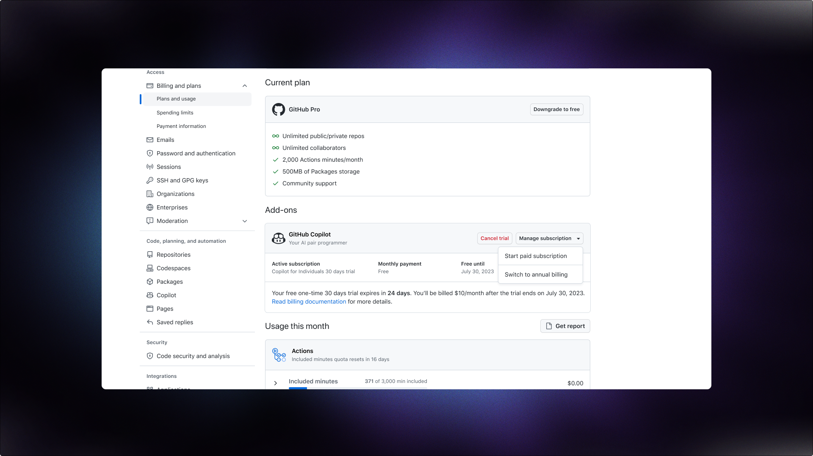

# **GitHub Copilot – 8월11일 업데이트**

오늘 업데이트에서는 IntelliJ extension 내에서 언어에 대한 허용 목록을 설정하고, 연간 GitHub Copilot for Individuals 계획으로 빠르게 전환하고, Code reference기능의 private preview에 대한 업데이트입니다.

## **IntelliJ내에서 언어 설정 선택**

이전 `disabledLanguages` 구성이 보다 유연한 `languageAllowList` 의 새 구성으로 대체되었습니다. `\*`와일드카드를 사용하여 모든 언어를 한 번에 활성화 또는 비활성화할 수 있습니다..

### **github-copilot.xml 위치**

`github-copilot.xml`파일은 다음 위치에 있습니다.

```
~/Library/Application Support/JetBrains/<IDE+VERSION>/options/github-copilot.xml
``````

예를 들어 `IntelliJ` 버전 `2022.3`의 `github-copilot.xml`경로는 아래와 같습니다.

``````
~/Library/Application Support/JetBrains/IntelliJIdea2022.3/options/github-copilot.xml
``````
### **모든 언어를 활성화하기 위한 github-copilot.xml(기본 동작)**
``````
<application>
  <component name="github-copilot">
    <languageAllowList>
      <map>
        <entry key="*" value="true" />
      </map>
    </languageAllowList>
  </component>
</application>
``````

이제 구성에 와일드카드도 포함된 경우에도 개별 언어 재정의를 지정할 수 있습니다.

### **Kotlin 및 Java를 제외한 모든 언어를 비활성화하는 github-copilot.xml**
``````
<application>
  <component name="github-copilot">
    <languageAllowList>
      <map>
        <entry key="*" value="false" />
        <entry key="kotlin" value="true" />
        <entry key="java" value="true" />
      </map>
    </languageAllowList>
  </component>
</application>
``````

`languageAllowList`를 UI에서는 읽기 전용으로 만들어주는 새로운 hidden `languageAllowListReadOnly` configuration 속성이 추가되었습니다.

### **UI설정을 읽기 전용으로 만들고 모든 언어를 활성화하기 위한 github-copilot.xml**
``````
<application>
  <component name="github-copilot">
    <option name="languageAllowListReadOnly" value="true" />
    <languageAllowList>
      <map>
        <entry key="*" value="true" />
      </map>
    </languageAllowList>
  </component>
</application>
``````


## **Copilot for Individuals 트라이얼 및 plan 을 더 쉽게 관리하는 방법**

월별 결제와 연간 결제 간에 전환하는 방법에 대해 사용자들이 혼란스러워한다는 소식을 들었습니다. 우리는 여러분들이 GitHub Copilot 계획을 더 쉽게 완전히 제어할 수 있기를 바랍니다. Plans and Usage페이지를 통해 플랜 옵션 간 전환을 더 쉽게 할 수 있습니다. Copilot plan 섹션으로 가서 Manage subscription버튼을 눌러 옵션을 확인하세요.

또한 이 페이지에서 Copilot 트라이얼을 직접 활성화할 수 있는 옵션도 추가했습니다. 트라이얼 기간중 Copilot이 귀하에게 적합하지 않다고 판단되면 평가판으로 전환되기 전에 유료 플랜으로 전환되기 전에 신속하게 취소하실 수 있습니다.



## **[Private Beta] Code Referencing을 사용해 보세요 !**

지난주에 우리는 Copilot의 코드 참조에 대한 비공개 베타를 발표했습니다. 자세한 내용은 [블로그 게시물](https://github.blog/2023-08-03-introducing-code-referencing-for-github-copilot/)을 참조하시고, [대기자 명단에 등록](https://github.co/copilot-code-referencing-waitlist) 바로 등록하세요!

## **질문, 제안 또는 아이디어가 있으신가요?**

[Copilot 커뮤니티 토론](https://github.com/orgs/community/discussions/categories/copilot) 대화에 참여하세요.. 우리는 당신의 의견을 듣고 싶습니다!