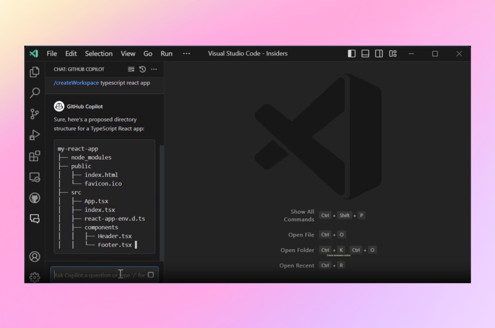
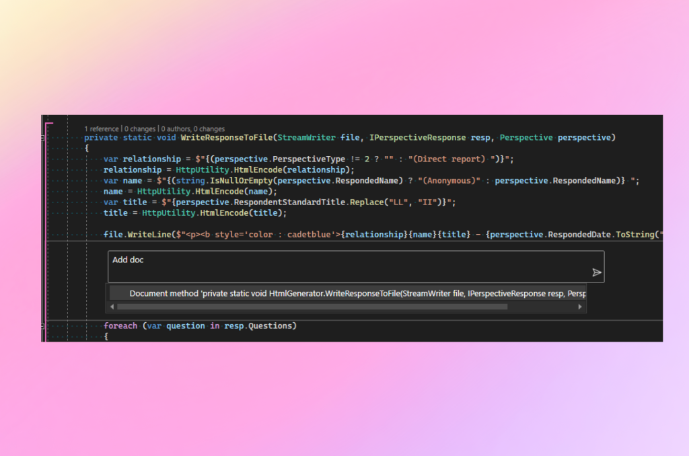
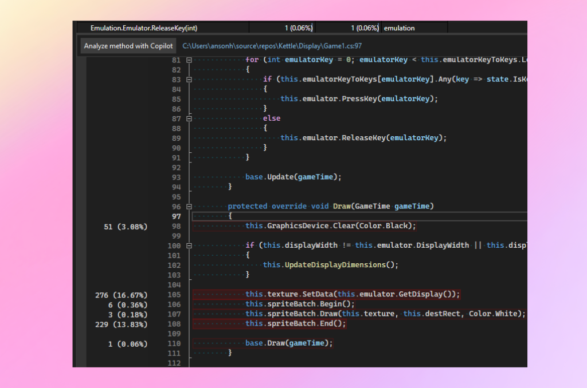

# **GitHub Copilot – 7월14일 업데이트**

2023년 7월 14일 [원본링크](https://github.blog/changelog/2023-07-14-github-copilot-july-14th-update/)

관리자를 위한 새로운 기능과 Visual Studio Code 및 Visual Studio extension의 Chat에 대한 다양한 개선 사항을 통해, GitHub Copilot을 계속해서 발전시키고 있습니다.

## 🤖 **사용자 관리 API(베타)를 사용하여 조직의 GitHub Copilot 액세스 자동화**

참고: 이 API는 베타 버전이며 피드백에 따라 변경될 수 있습니다.

비즈니스용 GitHub Copilot이 출시된 이후 UI를 통해 대규모 사용자 집합에 GitHub Copilot 라이선스를 할당하는 작업은 지루하고 시간이 많이 걸릴 수 있다는 피드백을 들었습니다. 특히 권한 관리를 위해 Teams를 활용해야 하는 경우 더욱 그렇습니다. 또한 오래된 사용자 목록을 정기적으로 수집하고 해당 액세스 권한을 취소하는 방법이 아직 없습니다. 따라서 관리자는 사용자의 마지막 활동 날짜를 페이지별로 검토하고 개별적으로 액세스 권한을 제거하는 데 귀중한 시간을 소비해야 합니다.

Copilot for Business용 새로운 사용자 관리 API를 사용하면 관리자는 모든 Copilot 지원 조직 구성원의 세부 정보를 나열하고 개인 및 팀에 대한 액세스를 추가/제거할 수 있습니다. 이를 통해 회사의 프로세스와 요구 사항에 맞게 규모에 맞게 액세스를 자동화할 수 있습니다. 이 API를 사용하려면, 액세스 토큰에 새로운 Manage\_billing:Copilot scope을 추가하여 인증해야 합니다.

[관련된 설명문서](https://docs.github.com/rest/copilot/copilot-for-business)를 확인하셔서 사용해 보시고 [토론 게시물](https://github.com/orgs/community/discussions/60780)에 피드백을 남겨주세요.!

## ✍️ **Visual Studio Code 1.80의 새로운 Create 명령**

프로젝트와 notebook을 만들고 workspace에서 텍스트를 검색하는 데 도움이 되도록 Chat view에 슬래시 명령어를 을 도입했습니다 (preview-only).

참고: Chat view, inline chat 및 슬래시 명령에 액세스하려면(예:/search,/createWorkspace) [GitHub Copilot chat 대기자 명단](https://github.com/github-copilot/chat_waitlist_signup/join)에 신청하시고, [GitHub 코파일럿](https://marketplace.visualstudio.com/items?itemName=GitHub.copilot)extension의 Pre-Release 버전을 설치합니다..

### **Create workspace**

Copilot에게 /createWorkspace슬래시 명령을 통해 인기 있는 프로젝트 유형에 대한 workspace을 생성하도록 요청할 수 있습니다. Copilot은 먼저 요청에 대한 디렉터리 구조를 생성합니다.

그런 다음 작업 Create Workspace 버튼을 사용하여 프로젝트 디렉터리를 새 작업 공간으로 만들고 열 수 있습니다.

### **Notebook 생성**

필요에 따라 /createNotebook슬래시 명령을 사용해 Jupyter 노트북을 생성하도록 Copilot에 요청할 수 있습니다. Copilot은 요청에 따라 Notebook의 outline를 생성합니다.

<iframe src="https://github.blog/wp-content/uploads/2023/07/253334560-5bb79b3e-fba2-4b3b-a3de-91acd8227b5e.mp4" style="width:100%; height:500px;"></iframe>

그런 다음 Create Notebook 명령을 사용하여 노트북을 만들고 제안된 개요에 따라 코드 셀을 채울 수 있습니다.

## **Visual Studio extension 개선**

- 다른 프로그래밍 언어에 대한 더 나은 지원 – XAML, Blazor, C++ 등에 대한 질문 결과의 품질을 향상했습니다.
- 채팅 기록 저장 및 복원 – 사용자가 Visual Studio를 닫을 때마다 토론/채팅이 손실되는 것을 방지합니다. 이제 지속되고 복원되었습니다.
- 채팅 기록 지우기 - Copilot의 프롬프트 및 답변에서 이전 대화의 맥락을 고려하지 않도록 채팅 기록을 지우는 기능이 추가되었습니다.
- Multiline 프롬프트 상자 – 사용자가 보다 확장된 질문을 쉽게 할 수 있도록 프롬프트 입력을 개선했습니다.
- 채팅 도구 창에 콘텐츠를 표시하기 위한 스트리밍 지원 – 모든 채팅 경험에 스트리밍 지원을 추가했습니다.
- 테스트 생성을 위한 특정 삽입 – 테스트 생성을 위해 별도의 파일이나 프로젝트에 삽입해야 하는 경우가 있습니다. 이제 채팅창의 작업 버튼을 통해 특수 처리를 지원합니다.
- Quality of life 업데이트 – 채팅 경험 전반에 걸쳐 더 나은 context, UI 새로 고침 및 오류 메시지.

### **임베딩을 기반으로 표시되는 상황 인식 기반 action**

문서화, 설명, 테스트 생성과 같은 상황 인식 작업을 도입하고 있습니다. 이러한 작업은 기존 인라인 컨텍스트를 사용하여 특정 의도를 만들어 해당 작업에 대한 최적의 마법 같은 경험을 제공합니다.

### **CPU 사용량 도구에서 GitHub Copilot을 사용한 분석 방법**

Copilot Chat은, trigger되었을 때 문제가 발생한 이유를 설명하고 해결 방법을 제안합니다. 이러한 정보들은 diagnostic experience에 표시됩니다. 이를 위해서는 Visual Studio의 미리 보기 버전을 사용해야 합니다.

Copilot에 대해 자세히 알아보고 Copilot의 모든 기능을 최대한 활용하려면 [YouTube Copilot 재생목록](https://www.youtube.com/playlist?list=PL0lo9MOBetEHEHi9h0k_lPn0XZdEeYZDS)을 방문하십시오. 가입하려면 [Copilot features](https://github.com/features/copilot)페이지를 참조하세요.