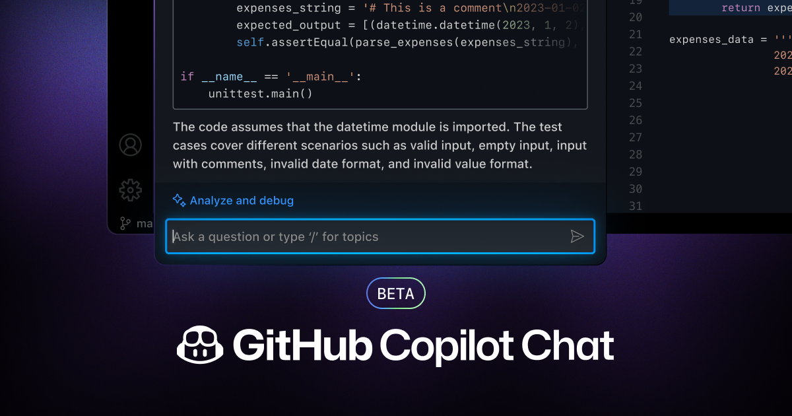
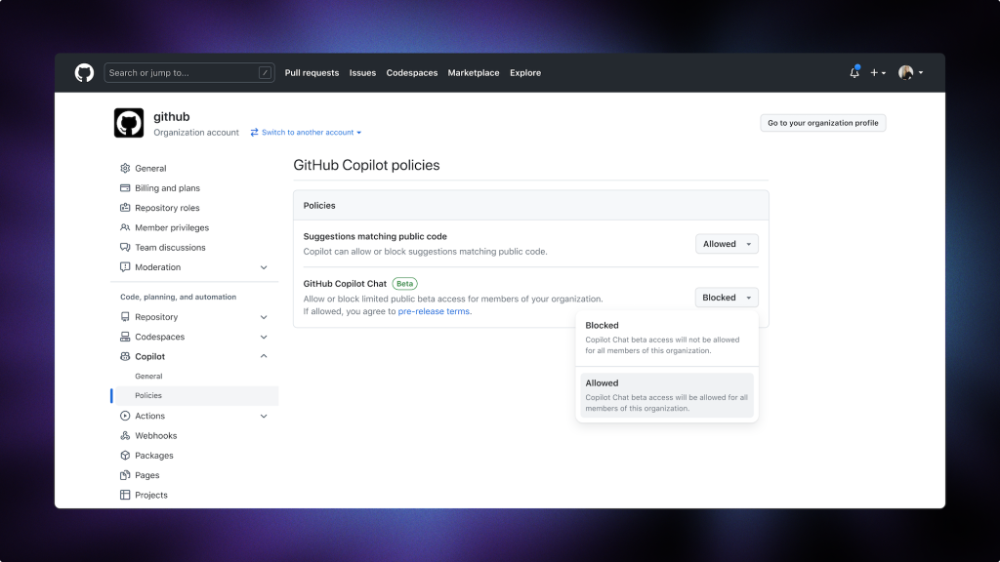

##
# **이제 모든 조직에서 GitHub Copilot Chat 베타를 사용할 수 있습니다**

####이제 모든 비즈니스용 GitHub Copilot 사용자는 제한된 GitHub Copilot Chat 베타에 액세스할 수 있어 대화형 코딩의 강력한 기능을 IDE에 직접 적용할 수 있습니다.

[마리오 로드리게스](https://github.blog/author/mariorod/)

2023년 7월 20일 : [원본링크](https://github.blog/2023-07-20-github-copilot-chat-beta-now-available-for-every-organization/)

GitHub 올해 초 [GitHub 코파일럿 X](https://github.com/features/preview/copilot-x)를 발표했습니다. 여기에는 GitHub의 전체 개발자 경험에 걸쳐 생성 AI 및 GPT-4의 강력한 기능을 제공하도록 설계된 다양한 기술 미리보기가 포함되어 있습니다. 오늘 우리는 Visual Studio 및 VS Code의 모든 비즈니스 사용자를 위한 GitHub Copilot Chat의 제한된 공개 베타 릴리스를 통해 GitHub Copilot X를 기업 및 조직에 제공하는 첫 번째 단계를 밟게 되어 기쁘게 생각합니다.

이 새로운 진화는 GitHub Copilot을 IDE에서 바로 Context를 인식하는 대화형 도우미로 전환하여 개발자가 간단한 프롬프트로 복잡한 작업들을 실행할 수 있게 해줍니다. 경험이 적은 개발자부터 가장 경험이 풍부한 개발자까지 팀의 모든 개발자는 며칠이 아닌 몇 분 만에 전체 애플리케이션을 구축하거나 방대한 코드 배열을 디버깅할 수 있습니다. 단위 테스트와 끝없는 boilerplate 코드들의 백로그 때문에 몇 주 또는 몇 달을 소비하는 일은 이제 과거의 일이 될 것입니다. GitHub Copilot X의 핵심 기능으로, Copilot Chat은 자연어가 코딩 경험을 강화하고 소프트웨어 개발을 대중화하며 전체 개발자 팀을 더 행복하고 생산적으로 만드는 새로운 시대로의 문을 활짝 열 것이라고 믿습니다.

이는 모든 개발자와 조직의 더 나은 미래를 구성할 것입니다. 오늘 발표 내용과 조직에서 개발자가 최고의 역량을 발휘할 수 있도록 지원하기 위해 활용할 수 있는 주요 기능에 대해 알아보겠습니다.

## 기업이 GitHub Copilot Chat 베타를 활성화하는 방법

GitHub Copilot for Business 관리자는 다음 단계를 통해 개발팀에 이 새로운 베타에 대한 액세스를 제공할 수 있습니다.

#### 기업 관리자

엔터프라이즈 관리자는 조직 관리자에게 개별 조직에 대한 설정을 구성하거나 모든 조직에 균일한 설정을 적용할 수 있는 권한을 부여할 수 있습니다. 이를 달성하기 위해 기업 관리자는 관리 페이지에 액세스하고 "Polices" 탭으로 이동하여 "Copilot"을 선택합니다. 이 섹션에는 모든 조직에 대한 Copilot Chat(베타) 액세스를 허용 또는 제한하거나 "No Policy"을 선택하여 조직 관리자에게 결정을 위임할 수 있는 옵션이 제공됩니다.

#### 조직 관리자

1. Copilot 설정으로 이동합니다. 관리자는 조직의 설정 페이지로 이동하여 "Copilot" 탭을 클릭하여 GitHub Copilot 설정을 찾을 수 있습니다.
2. "Policies" 탭을 클릭하세요. "Copilot" 탭 내의 "Policies" 탭에서는 관리자가 GitHub Copilot Chat 베타에 대한 설정을 구성할 수 있습니다.
3. 이용약관에 동의하세요. 모든 사용자에 대해 GitHub Copilot Chat 베타를 활성화하려면 관리자가 [이용 약관](https://github.co/copilot-chat-terms)을 수락해야 합니다. "허용" 옵션을 선택하면 됩니다. 기업 관리자 권한이 없거나 기업 관리자가 정책을 'No Policy'으로 설정하여 권한을 부여한 경우에만 조직 관리자가 Chat 베타 액세스를 허용할 수 있습니다.

  _****GitHub 관리자가 개발 팀을 위해 GitHub Copilot Chat의 limited beta를 활성화하는 메뉴****_

관리자가 약관에 동의하면 조직 내의 모든 사용자는 GitHub Copilot Chat 베타를 시작하는 데 도움이 되는 자세한 설치 지침이 포함된 이메일을 받게 됩니다.

## **The power of context 🔍**

GitHub Copilot Chat은 단순한 채팅 창이 아닙니다. 개발자가 입력한 코드나 표시되는 오류 메시지를 상황에 맞게 인식합니다. 그리고 이러한 컨텍스트가 핵심입니다. 다른 범용적인 목적의 생성형 AI 채팅 도우미와 달리 GitHub Copilot Chat은 개발자를 위해 설계되었으며 IDE에 딱 맞게 구성되어 있습니다. 간단히 말해서, 우리는 일반적인 목적에 적합한 것을 선택하여 개발자 환경을 상황에 맞게 인식하도록 만들고 있습니다.

이 모든 것은 지난 20년 동안 언어, 클라우드 컴퓨팅, 프로그래밍 프레임워크, CI/CD 워크플로, 오픈 소스 소프트웨어, 패키지 관리자, 서비스 등이 폭발적으로 증가하면서 점점 더 어려워지고 있는 상황에서 개발자들의 집중을 유지하기 위해 설계되었습니다.

오늘날 개발자들은 그 어느 때보다 더 많은 것을 구축할 수 있습니다. 그러나 API에 연결하는 방법, 새 데이터베이스를 사용하는 방법, 동료가 달성하려는 작업을 이해하기 위해 문서와 검색 결과를 자세히 조사하는 데 점점 더 많은 시간을 보내고 있습니다.

연구 결과도 그만큼 입증되었습니다.[Stack Overflow의 2023년 개발자 설문조사에 따르면](https://survey.stackoverflow.co/2023/#section-productivity-impacts-daily-time-spent-searching-for-answers-solutions), 63%의 개발자는 답변과 솔루션을 찾는 데 하루에 최소 30분, 최대 2시간을 소비한다고 말합니다. 그리고 이제 그들은 고객을 위한 새로운 솔루션에 대해 창의적이거나 혁신을 할 수 없습니다.

<iframe src="../assets/images/ch08/253630496-7947affa-b82b-4753-af00-a260105ec60e.mp4"></iframe>

우리는 개발자가 가장 중요한 일, 즉 미래를 구축하는 데 시간을 할애할 수 있도록 돕고 싶습니다. 그리고 이 작업은 IDE에서 바로 코드 제안을 제공하는 GitHub Copilot으로 시작되었습니다. 하지만 이제 GitHub Copilot Chat을 사용하면 개발자는 코드 제안을 받을 수 있을 뿐만 아니라 질문하고, 설명을 받고, 코드에 대한 프롬프트를 제공하는 등의 작업을 수행할 수 있습니다. 이는 그들이 IDE에서 더 많은 시간을 보내고 있다는 것을 의미하며, 그만큼 집중할 수 있다는 것을 의미합니다.

**이제 비즈니스용**  **GitHub Copilot**에 **VS Code** 및 **Visual Studio**용  **GitHub Copilot Chat**  **베타가 포함됩니다**.

GitHub Copilot Chat은 단순한 채팅 창 그 이상입니다. 개발자가 입력한 코드, 표시되는 오류 메시지를 인식하고 IDE에 깊숙이 내장되어 있습니다. 주요 기능은 다음과 같습니다:

- **개인형 맞춤형 지원**. GitHub Copilot Chat은 개발자에게 상황별 지원을 제공합니다. 따라서 엔지니어가 특정 코드 snippet에서 막혔거나, 특정 프로그래밍 개념에 대한 지침이 필요한 경우 GitHub Copilot Chat이 도움을 드릴 준비가 되어 있습니다.
- **실시간 안내**. GitHub Copilot Chat은 특정 코딩 문제에 맞는 모범 사례, 팁 및 솔루션을 모두 실시간으로 제안합니다.
- **보안 문제를 해결합니다**. GitHub Copilot Chat은 해결 방법을 제안하여 보안 검사 중에 발견되는 취약점의 수를 줄이는 데 도움이 됩니다.
- **코드 분석**. 코드 블록이 무엇을 동작 하는지 모르시나요? GitHub Copilot 채팅에 문의하세요. 또한 복잡한 개념을 분석하고 코드 조각을 설명할 수도 있습니다.
- **간단한 문제 해결**. 코드를 디버그하려고 하시나요? GitHub Copilot Chat은 문제를 식별할 뿐만 아니라 제안, 설명 및 대체 접근 방식도 제공합니다.

## **오리지널**  **AI**  **페어 프로그래머 레벨 업 🚀**

세계 최초의 대규모 AI 페어 프로그래머인 GitHub Copilot은 이미 20,000개 이상의 기업과 [개발자 팀에게 작업시간을 절반으로 단축할 수 있도록 해주고 있습니다](https://github.blog/2022-09-07-research-quantifying-github-copilots-impact-on-developer-productivity-and-happiness/). 그리고 [분석 회사](https://github.blog/2023-06-27-the-economic-impact-of-the-ai-powered-developer-lifecycle-and-lessons-from-github-copilot/)[Keystone.AI와 Harvard Business School 교수 Marco Iansiti의 연구](https://github.blog/2023-06-27-the-economic-impact-of-the-ai-powered-developer-lifecycle-and-lessons-from-github-copilot/)를 통해, 우리는 GitHub Copilot과 같은 생성형 AI 도구가 상당한 생산성 향상을 촉진하여 2030년까지 글로벌 GDP(국내총생산)를 1조 5천억 달러까지 늘릴 수 있는 잠재력이 있다는 것을 발견했습니다.

우리는 이것이 개발자가 생성형 AI의 힘을 통해 경험하게 될 경제적 및 생산성 향상의 시작점일 뿐이라고 믿습니다.

GitHub Copilot X 전체를 일반에 공개할 준비를 하면서 우리는 모든 개발자의 생산성이 10배 더 높아질 수 있다고 믿습니다. 이는 10일의 작업이 하루 만에 완료됨을 의미합니다. 10시간의 작업을 1시간만에 끝냈습니다. 단일 프롬프트 명령으로 10분의 작업이 완료되었습니다. 이를 통해 개발자는 자신의 진정한 자기 표현을 증폭시킬 수 있습니다. 그리고 이는 새로운 세대의 개발자가 생각의 속도로 학습하고 개발할 수 있도록 해 줄 것입니다.