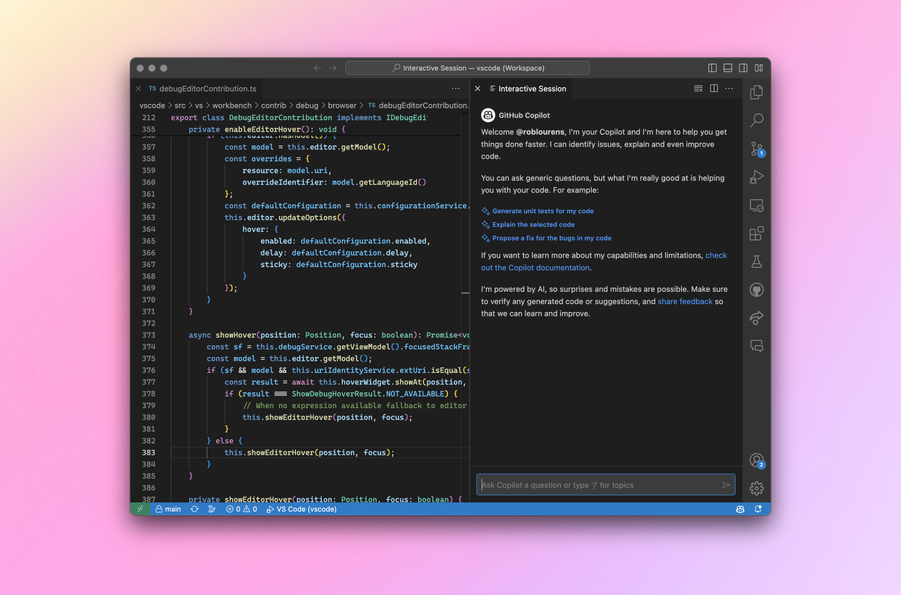
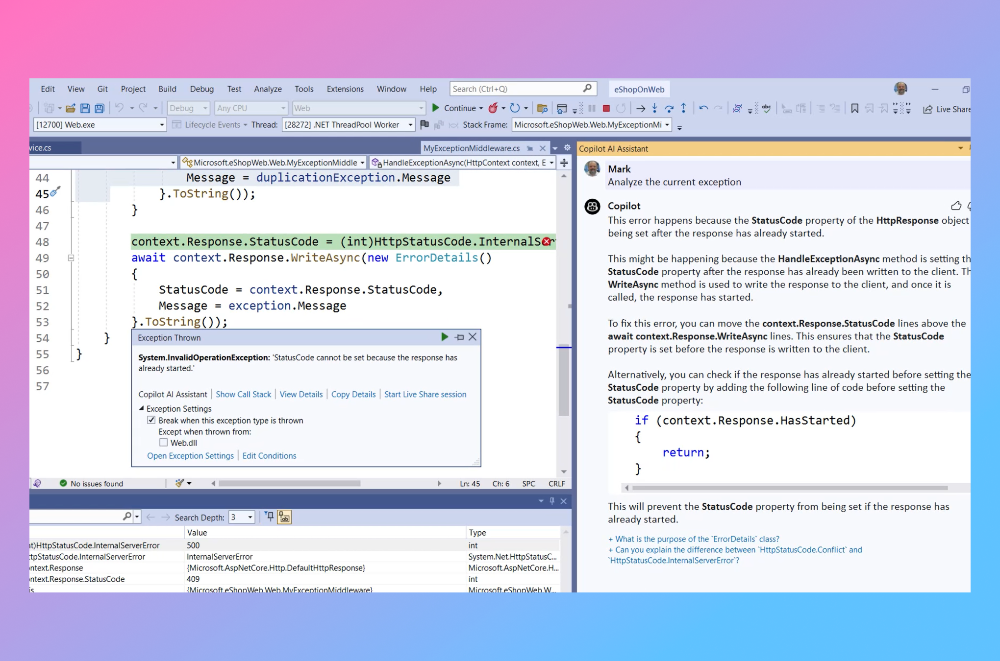

# **GitHub Copilot – 6월29일 업데이트**

2023년 6월 29일 [원본링크](https://github.blog/changelog/2023-06-29-copilot-june-2023-update/0629-)

20,000개 이상의 조직에서 GitHub Copilot을 사용하고 있으며 🎉 Copilot Chat 기능에 대한 시장 기대가 증가함에 따라, 본 블로그를 통해 최신 업데이트 및 추가된 기능을 강조드리겠습니다.

### **GitHub Copilot Chat(Visual Studio Code)**

참고: 새로운 채팅 기반 GitHub Copilot 기능에 액세스하려면 [GitHub Copilot 채팅 대기자 명단](https://github.com/github-copilot/chat_waitlist_signup/join)에 등록하세요.

GitHub Copilot Chat extension은 [비주얼 스튜디오 코드](https://code.visualstudio.com/updates/v1_79#_github-copilot)[v1.79](https://code.visualstudio.com/updates/v1_79#_github-copilot)의 출시와 함께 Insiders에서 Stable로 전환되었습니다. 주요 내용은 다음과 같습니다:

– editor chat 개선, 특히 기본 모드를 "livePreview"로 변경했습니다. 이 모드에서는 변경 사항이 문서에 직접 적용되고 [내장된](https://code.visualstudio.com/assets/updates/1_79/copilot-editor-chat.png)[diff view](https://code.visualstudio.com/assets/updates/1_79/copilot-editor-chat.png)로 표시됩니다.
– Notebook 문서에서 Copilot을 사용할 때 Copilot은 Notebook 컨텍스트를 사용하여 보다 관련성이 높은 제안을 제공할 수 있습니다.
– Notebook 셀을 실행할 때 Copilot은 셀 실행 실패에 대한 제안을 제공합니다.
– 리뷰 스레드를 볼 때 이제 Copilot을 사용하여 리뷰 코멘트를 직접 적용할 수 있습니다.
– 채팅을 사용하여 context를 벗어나지 않고 빠르게 프로그래밍에 대해 질문을 하는 실험적인 기능이 진행중입니다.
– 이제 Chat request에서 X 아이콘을 클릭하여 채팅 요청/응답 쌍을 삭제할 수 있습니다.
– 사이드바와 편집기 간에 채팅 세션을 앞뒤로 이동하는 기능이 추가되었습니다.

이전 업데이트는 Insiders [2023년 4월(v1.78)](https://github.com/microsoft/vscode-docs/blob/vnext/release-notes/v1_78.md#github-copilot)릴리즈 노트를 참조하세요..

GitHub Copilot에 대한 자세한 내용과 팁, 요령, 모범 사례를 알아보려면 [VS 코드 YouTube 채널](https://www.youtube.com/playlist?list=PLj6YeMhvp2S5_hvBl2SE-7YCHYlLQ0bPt)을 참조하세요. 여기에는 GitHub Copilot에 대한 [소개](https://www.youtube.com/watch?v=Fi3AJZZregI&list=PLj6YeMhvp2S5_hvBl2SE-7YCHYlLQ0bPt&index=1), [언어별](https://www.youtube.com/watch?v=VsUQlSyQn1E&list=PLj6YeMhvp2S5_hvBl2SE-7YCHYlLQ0bPt&index=6) 사용법 및 [효과적인](https://www.youtube.com/watch?v=ImWfIDTxn7E&list=PLj6YeMhvp2S5_hvBl2SE-7YCHYlLQ0bPt&index=9)[prompting](https://www.youtube.com/watch?v=ImWfIDTxn7E&list=PLj6YeMhvp2S5_hvBl2SE-7YCHYlLQ0bPt&index=9)에 대한 가이드를 보실 수 있습니다.

### **디버거를 사용한 Copilot(Visual Studio)**

Visual Studio의 Copilot Chat은 예외가 발생했을 때 문제를 해결하는 방법을 파악하는 데 도움이 됩니다. 예외 대화 상자의 링크를 누르면 예외에 대한 설명과 함께 가능한 원인 및 문제를 인라인으로 해결하기 위한 제안된 코드 솔루션을 볼 수 있습니다. Copilot은 예외, 코드 및 변수 값에 대한 데이터를 수집하여 정확한 질문을 구성하고 훌륭한 답변을 얻는 데 도움을 줍니다. 이를 Hot Reload와 같은 강력한 기능과 결합하면 제안된 변경 사항을 테스트하고 훨씬 더 빠르게 작업을 진행할 수 있습니다.

### 이제 Visual Studio의 IntelliSense 목록을 통해 GitHub Copilot 코드 완성을 조정할 수 있습니다 

GitHub Copilot과 Visual Studio에 내장된 AI 지원 기능을 이제 함께 사용하면 더 좋습니다. 최신 릴리스(버전 1.84+)를 사용하면 IntelliSense가 열려 있을 때 Copilot이 보내준 예측이 표시될 뿐만 아니라, IntelliSense selection또한 [Copilot이 제공하는 예측을 안내합니다.](https://devblogs.microsoft.com/visualstudio/github-copilot-visual-studio-intellisense/)이를 통해 원하는 코드 완성을 탐색하고 얻을 수 있습니다. Visual Studio의 빌트인된 IntelliCode AI가, IntelliSense 목록의 멤버들이 선택하는 순위와 함께 제공하는 starred completions와 함께 사용하면 특히 유용합니다.

### **코드 완성 개선**

- GitHub Copilot은 이제 13% 대기 시간 개선을 제공하는 OpenAI, Azure AI 및 GitHub 간의 협업을 통해 GPT-3.5 Turbo로 구동되는 새로운 모델 덕분에 개발자를 위한 더욱 강력하고 반응성이 뛰어납니다.
- 코드 완성은 제안 및 수락률을 향상시키는 8k 컨텍스트 window를 사용합니다.

### **버그 수정 및 개선**

- 조직의 모든 사용자에 대한 CSV를 내보내는 기능이 추가되었습니다. seat 관리 페이지에서 모든 사용자의 단순 목록을 내보낼 수 있습니다. 이는 페이지를 하나씩 스크롤하는 것을 피하고 팀 내에서 Copilot을 사용하는 사람이 누구인지 더 잘 파악하려는 관리자의 중요한 문제점을 해결하는 데 도움이 됩니다.
- 하나의 유동적인 환경에서 GitHub 계정과 Copilot에 더 쉽게 등록할 수 있도록 Copilot singup 절차를 업데이트했습니다.
- 프랑스는 Copilot 코드 완성 요청을 서비스하는 최신 지역으로, 유럽 고객의 대기 시간을 개선합니다. 이는 기존의 스위스 입지에 추가되는 것입니다.
- Visual Studio에서는 코드 완성에 사용하는 것과 동일한 회색 텍스트 접근 방식을 사용하여 코드에 다시 삽입된 코드를 미리 볼 수 있는 기능을 추가했습니다.
- Visual Studio에서 이제 채팅 요청을 삭제할 수 있습니다.