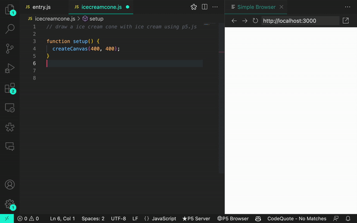
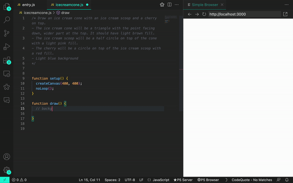
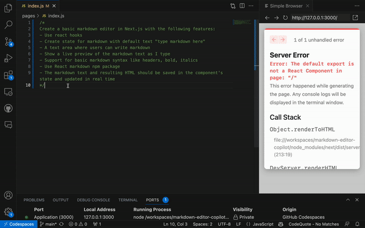

# **GitHub Copilot 사용 방법 : 프롬프트, 팁 및 사용 사례**

GitHub Copilot에 대한 이 프롬프트 가이드에서는 두 분의 GitHub 개발자 advocate인 Rizel과 Michelle이 원하는 결과를 AI 페어 프로그래머에게 전달하기 위한 예시와 베스트 프랙티스를 공유합니다.


저자

[리젤 스칼렛](https://github.blog/author/blackgirlbytes/)
[미셸 매너링](https://github.blog/author/mishmanners/)

2023년 6월 20일 [원본링크](https://github.blog/2023-06-20-how-to-write-better-prompts-for-github-copilot/)

생성형 AI 코딩 도구는 개발자가 일상적인 코딩 작업에 접근하는 방식을 변화시키고 있습니다. 코드베이스 문서화부터 단위 테스트 생성에 이르기까지 이러한 도구는 작업 흐름을 가속화하는 데 도움이 됩니다. 그러나 다른 신기술과 마찬가지로 항상 학습 곡선이 있습니다. 결과적으로, 초보자와 경험자 모두 개발자는 AI 기반 코딩 도우미가 원하는 출력을 생성하지 못할 때 때때로 좌절감을 느낍니다. (익숙한 느낌?)

예를 들어, GitHub Copilot에게 창의적인 코딩을 위한 JavaScript 라이브러리인 p5.js를 사용하여 아이스크림 콘을 그려달라고 요청했을 때 우리는 관련 없는 제안을 계속 받았거나 제안이 전혀 없는 경우도 있었습니다. 그러나 GitHub Copilot이 정보를 처리하는 방식에 대해 더 많이 알게 되었을 때 우리는 Copilot과 통신하는 방식을 조정해야 한다는 것을 깨달았습니다.

다음은 관련 없는 솔루션을 생성하는 GitHub Copilot의 예입니다.



프롬프트를 조정하자 더 정확한 결과를 생성할 수 있었습니다.



우리는 개발자이자 AI 애호가입니다. 저,[리젤](https://github.com/blackgirlbytes)은 GitHub Copilot을 사용하여 [브라우저 확장](https://github.blog/2023-05-12-how-i-used-github-copilot-to-build-a-browser-extension/), [가위바위보 게임](https://github.com/blackgirlbytes/rock-paper-scissors-copilot)을 만들었고, 그리고 [트윗을 보내기도 했습니다](https://dev.to/github/how-to-send-a-tweet-with-github-copilot-4ih7). 그리고 저,[미셸](https://github.com/mishmanners)은, 2016년에 AI 회사를 시작했습니다. 우리는 둘 다 GitHub의 개발자 advocate이며 GitHub Copilot과 일하는 것에 대한 최고의 팁을 공유해 드리도록 하겠습니다.

GitHub Copilot에 대한 이 가이드에서는 다음 내용을 다룹니다.

- [프롬프트가 정확히 무엇인지](https://github.blog/2023-06-20-how-to-write-better-prompts-for-github-copilot/#whats-a-prompt-and-what-is-prompt-engineering), 프롬프트 엔지니어링도 무엇인지(힌트: 개발자와 대화하는지 아니면 machine learning 연구원과 대화하는지에 따라 다릅니다).
- [세 가지 모범 사례](https://github.blog/2023-06-20-how-to-write-better-prompts-for-github-copilot/#3-best-practices-for-prompt-crafting-with-github-copilot) 그리고 [Prompt 제작을 위한 세 가지 추가 팁](https://github.blog/2023-06-20-how-to-write-better-prompts-for-github-copilot/#three-additional-tips-for-prompt-crafting-with-github-copilot).
- [예](https://github.blog/2023-06-20-how-to-write-better-prompts-for-github-copilot/#a-practice-example) 브라우저 extension을 만드는 예제로서, 직접 GitHub Copilot에게 prompting하는 것을 시도해 볼 수 있습니다.

### **완벽함을 넘어서는 발전**

AI를 사용해 본 경험에도 불구하고 우리는 모두가 생성형 AI 기술에 대한 시행착오 단계에 있다는 것을 알고 있습니다. 또한 개발자가 작업 중인 개별 문제와 마찬가지로 모델이 다양하기 때문에 일반화된 프롬프트 제작 팁을 제공하는 것이 어렵다는 것도 알고 있습니다. 이것은 모든 것이 가능한 가이드가 아닙니다. 대신, 이 새로운 소프트웨어 개발 시대에 집단 학습을 가속화하기 위해 저희가 프롬프트 제작에 대해 배운 내용을 공유해 드리겠습니다.

## **프롬프트란 무엇이고 프롬프트엔지니어링이란 무엇인가?**

그것은 당신이 누구와 이야기하는지에 달려 있습니다.

생성형 AI 코딩 도구의 맥락에서 **프롬프트는 이러한 도구를 구축하고 미세 조정하는 Machine learning(ML) 연구원에게 문의하는지** , 아니면 IDE에서 이 도구를 사용하는 **개발자에게** 문의하는지에 따라 다른 의미를 가질 수 있습니다.

이 가이드에서는 IDE에서 생성형 AI 코딩 도구를 사용하는 개발자의 관점에서 용어를 정의하겠습니다. 그러나 전체 그림을 제공하기 위해 아래 차트에 ML 연구원 정의도 추가했습니다.


|| 프롬프트 | Prompt engineering | Context |
| --- | --- | --- | --- |
| 개발자 | 개발자가 GitHub Copilot에서 특정 제안을 생성하기 위해 작성하는 **코드 블록, 개별 코드 줄 또는 자연어 주석**| 특정 코딩 제안을 생성하기 위해 **IDE에 지침이나 코멘트 제공** | 생성형 AI 코딩 도구에서 원하는 출력을 구체적으로 명시하기 위해 **개발자가 제공하는 세부 정보** |
| ML 연구원 | **알고리즘에 의해 지속적으로 생성되어** 생성형 AI 코딩 도구의 모델로 전송되는 **IDE**  **코드 및 관련 컨텍스트** (IDE 주석, 열린 파일의 코드 등) **의 모음** | [Large Language 모델에 대한 프롬프트(IDE 코드 및 컨텍스트의 모음)를 생성하는 알고리즘 만들기](https://github.blog/2023-05-17-how-github-copilot-is-getting-better-at-understanding-your-code/#how-github-copilot-understands-your-code) | 코드에 대한 추가 정보로 알고리즘이 LLM(대형 언어 모델)에 보내는 세부정보([열려 있는 파일의 데이터 및 커서 전후에 작성한 코드 등](https://github.blog/2023-05-17-how-github-copilot-is-getting-better-at-understanding-your-code/#how-github-copilot-understands-your-code)) |

## **GitHub Copilot 프롬프트 제작을 위한 3가지 모범 사례**

### **1. 상위 수준의 목표를 가지고 기초적인 분위기 설정 🖼️**

이는 빈 파일이나 빈 코드베이스가 있는 경우 가장 유용합니다. 즉, GitHub Copilot에 구축하거나 달성하려는 내용에 대한 컨텍스트가 없는 경우 AI 페어 프로그래머를 위한 기초적인 분위기를 설정하는 것이 정말 유용할 수 있습니다. 세부 사항을 시작하기 전에 생성하려는 내용에 대한 큰 그림 설명으로 GitHub Copilot을 준비하는 데 도움이 됩니다.

GitHub Copilot에 프롬프트를 줄 때, 이 프로세스를 누군가와 대화하는 것으로 생각하세요. 문제를 어떻게 나열하여 함께 해결할 수 있을지? 이 사람과 어떻게 페어 프로그래밍을 함께 할 수 있을지?

예를 들어 Next.jst에서 마크다운 편집기를 구축할 때 다음과 같은 주석을 작성할 수 있습니다.

``````
/*
Create a basic markdown editor in Next.js with the following features:
- Use react hooks
- Create state for markdown with default text "type markdown here"
- A text area where users can write markdown 
- Show a live preview of the markdown text as I type
- Support for basic markdown syntax like headers, bold, italics 
- Use React markdown npm package 
- The markdown text and resulting HTML should be saved in the component's state and updated in real time 
*/
``````
그러면 GitHub Copilot이 다음 코드를 생성하고 30초 이내에 매우 간단하고 스타일이 없지만 기능적인 마크다운 편집기를 생성하게 됩니다. 남은 시간을 사용하여 구성 요소의 스타일을 지정할 수 있습니다.



_참고:_ _이 세부 수준은 원하는 출력을 생성하는 데 도움이 되지만 결과는 여전히 결정적이지 못 할 수 있습니다.예를 들어, 코맨트에 GitHub Copilot 에게 "여기에 마크다운을 입력하세요"라는 기본 텍스트를 생성하도록 요청했지만 대신 기본 단어로 "마크다운 미리보기 "를 생성했습니다._

### **2. 간단하고 구체적으로 질문하십시오. GitHub Copilot에서 짧은 출력을 받는 것을 목표로 하세요. 🗨️**

AI 페어 프로그래머에게 주요 목표를 전달한 후, **해당 목표를 달성하기 위해 따라야 하는 로직과 단계를 명확히 설명하세요.** GitHub Copilot은 해야할 것들을 나열해 줄 때 목표를 더 잘 이해합니다. (레시피를 작성한다고 상상해 보세요. 만들고 싶은 요리를 설명하는 단락을 쓰지 않고, 요리 과정을 개별 단계로 나눌 것입니다.)

GitHub Copilot이 한 번에 여러 코드를 생성하도록 요청하는 대신 **각 단계 후에 코드를 생성하도록 하세요**.

다음은 저희가 GitHub Copilot에 문장의 단어 순서를 뒤집는 함수를 만들기 위해 단계별로 명령을 주는 예입니다.


### **3. GitHub Copilot에게 한두 가지 예를 들어 주세요. ✍️**

예제를 통해 배우는 것은 인간뿐만 아니라 AI 페어 프로그래머에게도 유용합니다. 예를 들어, 아래 데이터 배열에서 이름을 추출하여 새 배열에 저장하려고 했습니다.
``````
const data = [
  [
    { name: 'John', age: 25 },
    { name: 'Jane', age: 30 }
  ],
  [
    { name: 'Bob', age: 40 }
  ]
];
``````
GitHub Copilot에 예제를 보여주지 않았을 때…
``````
// Map through an array of arrays of objects to transform data
const data = [
  [
    { name: 'John', age: 25 },
    { name: 'Jane', age: 30 }
  ],
  [
    { name: 'Bob', age: 40 }
  ]
];

const mappedData = data.map(x => [x.name](http://x.name/));

console.log(mappedData);

// Results: [undefined, undefined]
``````
Copilot은 map을 잘못 사용하는 코드를 생성하였습니다.
``````
const mappedData = data.map(x => [x.name](http://x.name/));

console.log(mappedData);

// Results: [undefined, undefined]
``````

대조적으로, 예제를 제공했을 때…
``````
// Map through an array of arrays of objects
// Example: Extract names from the data array
// Desired outcome: ['John', 'Jane', 'Bob']
const data = [
  [{ name: 'John', age: 25 }, { name: 'Jane', age: 30 }],
  [{ name: 'Bob', age: 40 }]
];


const mappedData = data.flatMap(sublist => sublist.map(person => person.name));

console.log(mappedData);
``````
우리는 원하는 결과를 얻었습니다.
``````
const mappedData = data.flatMap(sublist => sublist.map(person => person.name));

console.log(mappedData);
// Results: ['John', 'Jane', 'Bob']
``````
다음과 같은 AI 훈련에 대한 일반적인 접근 방식에 대해 자세히 알아보세요. [zero-shot, one-shot, few-shot learning](https://dev.to/github/a-beginners-guide-to-prompt-engineering-with-github-copilot-3ibp/#1424065).

## **GitHub Copilot 프롬프트 제작을 위한 세 가지 추가 팁**

여러분들이 GitHub Copilot과 대화하는데 도움이 되는 세 가지 추가 팁은 다음과 같습니다.

### **1.프롬프트를 실험해 보세요.**

대화가 과학이라기보다 예술에 더 가까운 것처럼 프롬프트 제작도 마찬가지입니다. 따라서 첫 번째 시도에서 원하는 결과를 얻지 못한 경우 위의 모범 사례에 따라 메시지를 다시 작성하세요.

예를 들어, 아래 프롬프트는 모호합니다. GitHub Copilot이 관련 제안을 생성하기 위한 컨텍스트나 범위를 제공하지 않습니다.
``````
# Write some code for grades.py  
``````
보다 구체적으로 설명하기 위해 프롬프트를 반복했지만 여전히 원하는 정확한 결과를 얻지 못했습니다. 이는 프롬프트에 구체성을 추가하는 것이 생각보다 어렵다는 점을 상기시켜 줍니다. GitHub Copilot으로 부터 가장 유용한 제안을 생성하기 위해 개발 목표에 대해 어떤 세부 정보를 포함해야 하는지 처음부터 아는 것은 어렵습니다. 이것이 바로 우리가 실험을 장려하는 이유입니다.

아래 프롬프트 버전은 위 버전보다 더 구체적이지만 입력 및 출력 요구 사항을 명확하게 정의하지 않습니다.
``````
# Implement a function in grades.py to calculate the average grade
``````
우리는 범위를 설정하고 함수에서 수행하려는 작업의 개요를 설명하여 프롬프트를 다시 한 번 실험했습니다. 또한 기능이 더욱 명확해지도록 주석을 다시 작성했습니다(GitHub Copilot에 검증하려는 명확한 의도 제공).

이번에는 우리가 원하던 결과를 얻었습니다.
``````
# Implement the function calculate_average_grade in grades.py that takes a list of grades as input and returns the average grade as a floating-point number
``````
### **2.관련 탭 몇 개를 열어두세요.**

GitHub Copilot이 여러분의 코드를 맥락화하는 데 도움을 주기 위해 열어 두어야 할 탭의 정확한 개수는 없지만, 저희의 경험에 따르면 한두 개가 도움이 되는 것으로 나타났습니다.

[GitHub Copilot은 neighboring tabs라는 기술을 사용합니다.](https://github.blog/2023-05-17-how-github-copilot-is-getting-better-at-understanding-your-code/#how-github-copilot-understands-your-code)이를 통해 AI 페어 프로그래머는 작업 중인 단일 파일 대신 IDE에 열려 있는 모든 파일을 처리하여 코드에 대한 맥락을 갖을 수 있습니다. 그러나 GItHub Copilot이 열려 있는 모든 파일을 코드에 필요한 컨텍스트로 간주한다고 보장할 수는 없습니다.

### **3.좋은 코딩 방법을 사용하십시오.**

여기에는 설명적인 변수 이름과 함수를 제공하고 일관된 코딩 스타일과 패턴을 따르는 것이 포함됩니다. 우리는 GitHub Copilot과 함께 일하면서 우리가 경력 전반에 걸쳐 배운 좋은 코딩 방법을 따르도록 장려한다는 것을 알았습니다.

예를 들어 여기서는 설명적인 함수 이름을 사용하고 스네이크 케이스를 활용하는 코드베이스의 패턴을 따랐습니다.
``````
def authenticate_user(username, password):
``````
이 결과 GitHub Copilot은 관련된 코드 제안을 생성했습니다.
``````
def authenticate_user(username, password):
    # Code for authenticating the user
    if is_valid_user(username, password):
        generate_session_token(username)
        return True
    else:
        return False
``````

비교를 위해, 아래와 같이 일관되지 않은 코딩 스타일을 사용하고 함수 이름을 잘못 지정해 보았습니다.
``````
def rndpwd(l):
``````
코드를 제안하는 대신 GitHub Copilot은 "코드는 여기에 표시됩니다."라는 주석을 생성했습니다.
``````
def rndpwd(l):
    # Code goes here
``````
### **스마트하게 지내세요**

생성형 AI 코딩 도구 뒤에 있는 LLM은 트레이닝 데이터에서 패턴을 찾고 추정하고 해당 패턴을 기존 언어에 적용한 다음 해당 패턴을 따르는 코드를 생성하도록 설계되었습니다. 이러한 모델의 엄청난 규모를 고려하면 아직 존재하지 않는 코드 시퀀스를 생성할 수도 있습니다. **동료의 코드를 검토하는 것처럼 항상 AI 생성 코드를 평가,분석 및 검증해야 합니다.**

## **연습 예시 👩🏻‍💻**

[GitHub Copilot에 브라우저 extension을 빌드하라는 프롬프트를 주어 보세요.](https://github.blog/2023-05-12-how-i-used-github-copilot-to-build-a-browser-extension/)

시작하려면 다음 사항이 필요합니다. [GitHub Copilot이 IDE에 설치되어 실행되고 있습니다.](https://docs.github.com/copilot/getting-started-with-github-copilot) 
저희는 [GitHub Copilot chat](https://gh.io/copilotx)의 early preview에 초기 미리보기를 사용할 수 있어, 코드에 대한 질문이 있을 때 사용했습니다. GitHub Copilot chat이 없다면, [대기자 명단에 등록하세요](https://github.com/github-copilot/chat_waitlist_signup/join). 그때까지는 ChatGPT의 [GitHub 코파일럿](https://github.com/features/copilot)과 페어링할 수 있습니다.

## **참조 생성형 AI 프롬프트 제작 가이드**

- [GitHub Copilot을 사용한 프롬프트 엔지니어링을 위한 초보자 가이드](https://dev.to/github/a-beginners-guide-to-prompt-engineering-with-github-copilot-3ibp)
- [AI를 위한 프롬프트 엔지니어링](https://dev.to/mishmanners/prompt-engineering-for-ai-l02-temp-slug-5273047?preview=551f0e25cb04a20f52bbf20dc42b6048806734e33f1c2c9f35372a5b8eab93eb2c52a82c2bd958b4dfabba5d52e7bd8b320ed66ae8e5275e7f006d55)
- [GitHub Copilot이 코드를 더 잘 이해하는 방법](https://github.blog/2023-05-17-how-github-copilot-is-getting-better-at-understanding-your-code/)