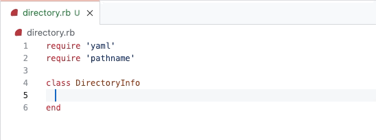
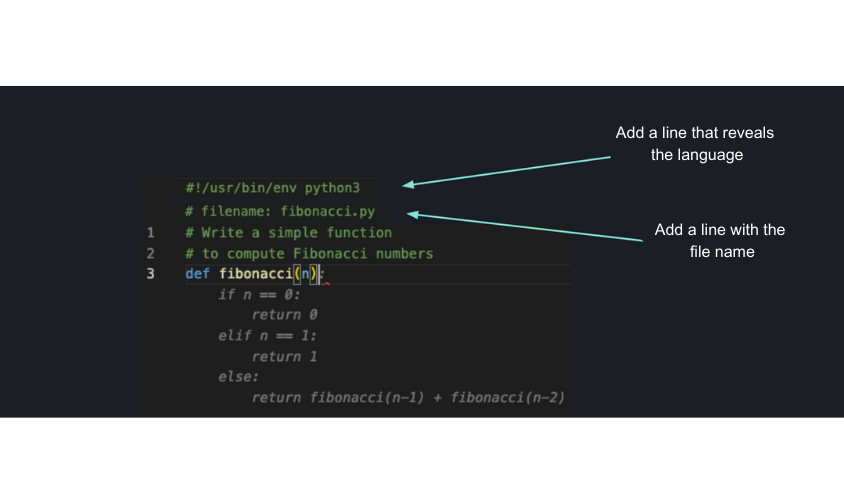

# **Inside GitHub: Working with the LLMs behind the GitHub Copilot**

GitHub Copilot 개발자들은 OpenAI의 대규모 언어 모델로 작업하는 것이 어땠는지, 그리고 이것이 오늘날 우리가 알고 있는 Copilot 개발에 어떻게 영향을 미쳤는지 논의합니다.

작가
[사라 게브](https://github.blog/author/saraverdi/)

2023년 5월 17일 [원본링크](https://github.blog/2023-05-17-inside-github-working-with-the-llms-behind-github-copilot/)

GitHub의 엔지니어들이 처음으로 OpenAI의 대규모 언어 모델(LLM) 중 하나로 작업했을 때 그들은 똑같이 흥분하고 놀랐습니다. [알리레자 구다르지](https://github.com/whatsinfinitum) GitHub의 머신러닝 선임 연구원은 다음과 같이 말합니다. "이론적 AI 연구자로서 내 임무는 딥 러닝 모델을 분해하여 모델을 이해하고 학습하는 방식을 이해하는 것이었지만, 모델이 나를 정말 놀라게 한 것은 이번이 처음이었습니다." 모델의 새로운 행동은 다소 놀랍지만 분명히 강력했습니다. 실제로 GitHub Copilot을 만들 정도로 강력합니다.

LLM 및 생성형 AI 모델에 대한 관심이 높아지면서 GitHub Copilot의 초기 버전을 구축하는 데 도움을 준 GitHub의 연구원 및 엔지니어와 대화하고 OpenAI의 다양한 LLM으로 작업하는 것이 어떤 것인지, 모델이 어떻게 작동하는지 이야기하기로 결정했습니다. 개선 사항은 GitHub Copilot을 현재와 그 이상으로 발전시키는 데 도움이 되었습니다.

## **GitHub Copilot의 간략한 역사**

2020년 6월, OpenAI는 개발자 커뮤니티와 그 밖의 사람들에게 흥미를 불러일으킨 LLM인 GPT-3를 출시했습니다. GitHub에서 이것은 우리 엔지니어들이 이전에 단지 이야기만 했었던 프로젝트를 시작할 수 있었습니다: 바로 Code generation 이었습니다.

"6개월 정도마다 회의에서 누군가가 '범용 코드 생성에 대해 생각해 봐야 할까요?'라고 묻곤 했지만 대답은 항상 '아니요, 너무 어렵습니다. 현재 모델로는 할 수 없습니다.' 였습니다."라고 수석 기계 학습 엔지니어이자 [GitHub Next](https://githubnext.com/) 연구 개발 팀의 [앨버트 지글러](https://github.com/wunderalbert) 말합니다.

그러나 GPT-3는 이 모든 것을 바꾸어 놓았습니다. 갑자기 모델이 코드 생성 도구의 작동 방식을 고려하기 시작하기에 충분했습니다.

"OpenAI는 우리에게 가지고 놀 수 있는 API를 제공했습니다."라고 Ziegler는 말합니다. "우리는 코딩과 유사한 작업을 하도록 주었고, 이를 두 가지 다른 형태로 평가했습니다."

첫 번째 형태의 평가에서 GitHub Next 팀은 모델 테스트를 돕기 위해 자체 포함된 문제를 크라우드소싱했습니다. "우리가 더 이상 이 일을 하지 않는 이유는 모델이 너무 좋아졌기 때문입니다."라고 Ziegler는 웃습니다.

처음에는 모델이 제기된 문제의 절반 정도를 해결할 수 있었지만 얼마 지나지 않아 문제의 90% 이상을 해결하게 되었습니다.

이 독창적인 테스트 방법은 이 모델의 기능을 활용하는 방법에 대한 첫 번째 아이디어를 촉발시켰으며 개발자가 코딩 질문을 하고 즉시 실행 가능한 코드 조각을 받을 수 있는 AI 기반 챗봇을 개념화하기 시작했습니다. Ziegler는 "우리는 프로토타입을 제작했지만 이 기술에 더 나은 방식이 있다는 것이 밝혀졌습니다."라고 말했습니다. "우리는 '이것을 IDE에 넣어보자'고 생각했습니다."

"우리가 그렇게 하고 그것이 얼마나 잘 작동하는지 확인한 순간, 정적인 질문과 답변 방식 전체가 잊혀졌습니다."라고 그는 말합니다. "이 새로운 접근 방식은 상호작용하는 것이었고, 거의 모든 상황에서 유용했습니다."

그리고 그와 함께, [GitHub 코파일럿](https://github.com/features/copilot/)의 개발이 시작 되었습니다.

## **모델 개선 탐구**

이 프로젝트를 계속 진행하기 위해 GitHub는 OpenAI로 돌아가 최신 모델을 계속 사용할 수 있는지 확인했습니다. "OpenAI가 우리에게 제공한 첫 번째 모델은 Python 전용 모델이었습니다."라고 Ziegler는 기억합니다. "다음으로 우리는 JavaScript 모델과 다언어 모델을 전달받았는데, Javascript 모델에는 다언어 모델에는 없는 특별한 문제가 있다는 것이 밝혀졌습니다. 다언어 모델이 그토록 뛰어난 성능을 발휘할 수 있다는 사실은 사실 우리에게 놀라운 일이었습니다. 하지만 매번 모델이 점점 더 좋아지고 있었고 이는 GitHub Copilot의 발전에 정말 흥미로웠습니다."

2021년 OpenAI는 GitHub와의 파트너십을 통해 구축된 다언어 [코덱스 모델](https://openai.com/blog/openai-codex)을 출시했습니다. 이 모델은 GPT-3의 파생물이므로 원래 기능은 텍스트 프롬프트에 응답하여 자연어를 생성하는 것이었습니다. 그러나 Codex 모델을 차별화한 점은 수십억 줄의 공개 코드에 대해 훈련을 받았기 때문에 자연어 출력 외에도 코드 제안도 생성했다는 것입니다.

이 모델은 기업이 구축할 수 있는 API를 통해 사용할 수 있도록 공개되었으며, GitHub Copilot에게는 이러한 획기적인 발전이 있었지만, 저희 팀은 최종 사용자에게 최대한 정확한지 확인하기 위해 내부 모델 개선 작업을 수행해야 했습니다.

GitHub Copilot 제품이 technical preview로 출시될 준비가 되면서 저희 팀은 추가 기능 팀으로 분리되었고, 모델 개선 팀은 기저의 LLM과의 통신을 통해 GitHub Copilot의 품질을 모니터링하고 개선하는 일을 담당하게 되었습니다. 이 팀은 또한 사용자를 위한 완성도를 높이는 작업에 착수했습니다. 완성도란 사용자가 코드에서 GitHub Copilot 제안을 수락하고 유지하는 것을 의미하며 모델 개선 팀이 프롬프트 제작 및 미세 조정을 포함하여 완성도를 높이기 위해 작업하는 여러 가지 수단이 있습니다.

_GitHub Copilot을 사용한 완료 사례입니다._

### **Prompt crafting**

LLM으로 작업할 때 원하는 결과를 얻으려면 매우 구체적이고 의도적인 입력이 필요하며 프롬프트 제작에서는 모델에서 최적의 완성도를 얻기 위해 이러한 요청을 전달하는 기술을 탐색합니다.

"매우 간단히 말해서 LLM은 핵심적으로 문서 완성 모델일 뿐입니다. 훈련을 위해 부분적인 문서가 제공되었으며 한 번에 하나의 토큰씩 문서를 완료하는 방법을 배웠습니다. 따라서 Prompt crafting 기법은 실제로 고객에게 도움이 되는 완성을 주도록 모델을 유도하는 '유사 문서'를 만드는 것입니다.", 모델 개선 팀의 기계 학습 선임 연구원인 [존 베리먼](https://github.com/jnbrymn)이 설명합니다. LLM은 부분 문서 완성에 대해 교육을 받았기 때문에 부분 문서가 코드인 경우 이 완성 기능은 기본 형식에서 정확히 GitHub Copilot이 수행하는 코드 완성에 적합합니다.

모델이 코드 완성에 어떻게 적용될 수 있는지 더 잘 이해하기 위해 팀에서는 모델에 파일을 제공하고 반환된 코드 완성을 평가했습니다.

Berryman은 "때로는 결과가 괜찮을 때도 있고, 꽤 좋을 때도 있고, 때로는 결과가 거의 마법처럼 느껴질 때도 있습니다."라고 말합니다. "비밀은 GitHub Copilot 사용자가 현재 편집 중인 원본 파일을 모델에 제공할 필요가 없다는 것입니다. 대신 우리는 모델이 더 나은 완성을 향한 힌트를 줄 수 있는 IDE 내부의 추가적인 컨텍스트 조각을 찾습니다."

그는 계속해서 "GitHub Copilot이 현재 위치까지 오는 데 도움이 주었던 몇 가지 변경 사항이 있었지만 제가 가장 좋아하는 트릭 중 하나는 사용자 편집기의 인접한 탭에서 유사한 텍스트를 가져오는 것이었습니다. 덕분에 승인률과 캐릭터 유지율이 크게 향상되었습니다."

생성 AI와 LLM은 믿을 수 없을 정도로 매력적이지만 Berryman은 여전히 ​​사용자가 연구 및 기술적인 노력을 통해 얻을 수 있는 이점에 대해 가장 기뻐하는 것 같습니다.

"여기서의 아이디어는 개발자의 생산성을 높이는 것입니다. 그러나 우리가 생산성을 높이고자 하는 그 방식에서 일이 흥미로워지기 시작합니다. 사용자가 코드에 대해 생각하는 방식을 알고리즘 자체에 통합함으로써 사용자의 생산성을 높일 수 있습니다." 베리먼은 말한다. "개발자가 참조 코드를 위해 탭 사이를 왔다 갔다 하는 것들에 대해, Copilot이 그것을 대신해 줄 수 있으며, Copilot이 제안해 주는 코드 완성이 바로, 사용자가 모든 시간을 들여 정보를 찾아 완성했을 코드가 될 것입니다."

### **미세 조정**

미세 조정은 특정 작업이나 영역에 대해 사전 훈련된 모델을 조정하고 개선하기 위해 AI에서 사용되는 기술입니다. 이 프로세스에는 대규모 데이터세트에 대해 교육된 사전 교육된 모델을 가져와 특정 사용 사례와 관련된 더 작고 구체적인 데이터세트에 대한 교육이 포함됩니다. 이를 통해 모델은 새로운 데이터의 미묘한 차이를 학습하고 이에 적응할 수 있어 특정 작업에 대한 성능이 향상됩니다.

이러한 더 크고 정교한 LLM은 "좋은" 응답을 구성하는 것이 무엇인지 통계적으로 정의하기 어렵기 때문에 때로는 도움이 되지 않는 결과를 생성할 수 있습니다. 1,700억 개 이상의 매개변수가 포함된 Codex와 같은 모델을 훈련시키는 것도 엄청나게 어렵습니다.

Goudarzi는 "기본적으로 우리는 보다 집중적이고 맞춤화된 완성 기능을 제공하기 위해 사용자의 특정 코드베이스에 대해 Codex 모델을 교육하고 있습니다."라고 덧붙였습니다.

Goudarzi는 "현재 우리의 가장 큰 과제는 사용자가 제안을 거부하거나 수락하는 이유를 고려하는 것입니다."라고 덧붙입니다. "우리가 모델에 제공한 어떤 context나 정보가, 모델로 하여금 도움이 되거나 도움이 되지 않는 결과를 출력하게 만들었는지 고려해야 합니다. 일반적인 엔지니어링 방식으로 실제로 문제를 해결할 수 있는 방법은 없지만, 원하는 결과를 얻기 위해 올바른 질문을 하는 방법을 알아내는 것이 우리가 할 수 있는 일입니다."

GitHub Copilot이 코드를 더 잘 이해하여 더욱 맞춤화된 코딩 경험을 제공하는 방법에 대해 [이곳](https://github.blog/2023-05-17-how-github-copilot-is-getting-better-at-understanding-your-code)에서 자세히 알아보세요.

## **GitHub Copilot - 그때와 지금**

OpenAI의 모델이 더욱 강력해지고, 저희가 내부 LLM을 기반으로 구축할 더 많은 영역을 찾게 됨에에 따라 GitHub Copilot의 기능이 향상되었으며, 또한 Chat기능, 음성 지원 개발, 그리고 [GitHub 코파일럿 X](https://github.blog/2023-03-22-github-copilot-x-the-ai-powered-developer-experience/)를 통해 계획중인 더 많은 기능들이 개발되고 있습니다.

[요한 로젠킬데](https://github.com/johanrosenkilde) GitHub Next 팀의 연구원은 "과거 OpenAI로부터 최신 모델을 받았을 때 개선 사항은 좋았지만 최종 사용자가 실제로 체감할 수는 없었습니다. Codex의 세 번째 버전이 출시되었을 때는 최종 사용자가 _느낄수 있는_ 정도가 되었고, 특히 상위 5개 언어 중 하나가 아닌 프로그래밍 언어로 작업할 때 더욱 그랬습니다."라고 Rosenkilde는 말합니다.

그는 계속해서 "모델 버전이 출시된 주말에 친구들과 프로그래밍 대회를 진행하고 있었는데, F#으로 프로그래밍을 하고 있었습니다. 처음 24시간 동안 우리는 분명히 GitHub Copilot의 이전 모델을 갖고 있었지만, 그 이후에는 BOOM! 정말 마법이 일어났습니다"고 웃었다. "엄청나게 눈에 띄는 차이가 있었어요."

처음에 GitHub Copilot은 완전히 다른 프로그래밍 언어로 코드 라인을 제안하는 경향이 있었는데, 이로 인해 개발자 경험이 좋지 않았습니다(다소 분명한 이유로).

Rosenkilde는 "C# 프로젝트에서 작업하다가 갑자기 새 파일의 맨 위에 Python 코드가 제안될 수 있었습니다."라고 설명합니다. 그래서 팀은 여러분이 작업 중인 언어를 나열하는 헤드라인을 프롬프트에 추가했습니다. "이것은, 여러분이 파일에 깊은 곳에서 작업할 때는, Copilot이 사용 중인 언어를 이해할 수 있었기 때문에 아무런 영향을 미치지 않았습니다. 하지만 파일 상단에는, 약간의 모호함이 있을 수 있으며 초기 모델은 기본적으로 가장 인기 있는 언어로 설정되었습니다."

개선된 지 약 한 달 후, 팀은 파일 경로를 문서 상단에 배치하는 것이 훨씬 더 강력하다는 것을 발견했습니다.

 
_파일 경로 개선 다이어그램._

Rosenkilde는 "대부분의 경우 파일 이름의 끝 부분이 사용되는 언어를 알려주게되며, 실제로 파일 이름이 중요한 추가 정보를 제공할 수 있습니다."라고 말합니다. "예를 들어 파일 이름이 'connectiondatabase.py'일 수 있습니다. 해당 파일은 데이터베이스나 연결에 관한 것일 가능성이 높으므로 SQL 라이브러리를 가져오고 싶을 수 있으며 해당 파일은 Python으로 작성되었습니다. 따라서 이는 언어 문제를 해결했을 뿐만 아니라, 이제 GitHub Copilot이 boilerplate 코드를 제안할 수 있기 때문에 품질과 사용자 경험도 놀라울 정도로 향상되었습니다."

몇 달 간의 추가 작업과 여러 번의 반복 끝에 팀은 다른 파일에서 코드를 끌어내는 구성 요소를 생성할 수 있었습니다. 이는 GitHub Copilot이 탄생한 이래로 이야기되어 왔던 기능입니다. Rosenkilde는 이렇게 회상합니다. "이 기능은 사실 너무 추상적이었기 때문에, 우리끼리의 대화나 draft pull request 수준을 넘어 실제 구현되기 힘들었습니다. 그러나 Albert Ziegler는 그 순간 IDE에 열려 있는 다른 파일을 살펴보고 해당 파일들을 검색하여 현재 커서에 있는 것과 유사한 텍스트를 검색하는 이 구성 요소를 만들었습니다. 이 기능으로 인해 GitHub Copilot이 다른 파일에 대해 알게 되었기 때문에 제안된 코드 승인이 크게 향상되었습니다."

## **GitHub Copilot의 다음 단계는 무엇입니까?**

저희는 지난 3년 동안 생성형 AI 모델과 LLM을 사용해 작업한 후 우리는 이들의 혁신적인 가치를 가까이서 확인했습니다. 업계가 계속해서 생성형 AI의 새로운 용도를 찾으면서 우리는 새로운 개발자 경험을 계속해서 구축하기 위해 노력하고 있습니다. 그리고 2023년 3월 GitHub는 Copilot의 미래인 [GitHub 코파일럿 X](https://github.blog/2023-03-22-github-copilot-x-the-ai-powered-developer-experience/)를 발표했으며, 이것은 AI 기반 개발자 경험에 대한 우리의 비전입니다. GitHub Copilot X는 IDE를 넘어 문서 및 Pull request와 같은 전체 플랫폼의 더 많은 구성 요소에 AI를 제공하는 것을 목표로 합니다. [LLM은 기술과 상호 작용하는 방식과 업무 방식을 변화시키고 있](https://github.blog/2023-04-14-how-generative-ai-is-changing-the-way-developers-work/#:~:text=A%202023%20study%20published%20by,switching%2C%20and%20conserves%20mental%20energy)으며, GitHub Copilot X와 같은 아이디어는 일부 전용 training 기술과 함께 이러한 모델이 무엇을 할 수 있는지 보여주는 예일 뿐입니다.