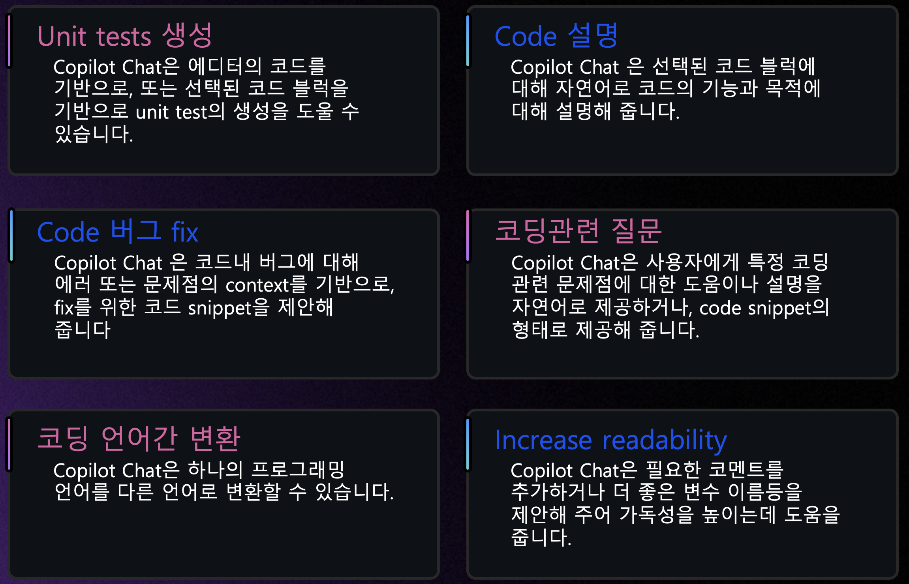
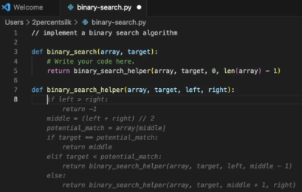
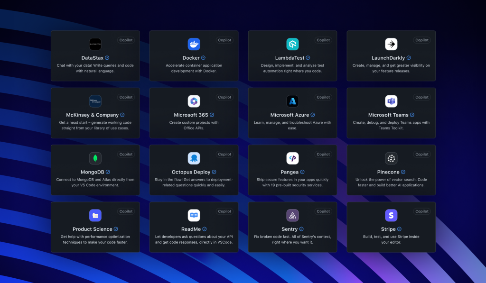
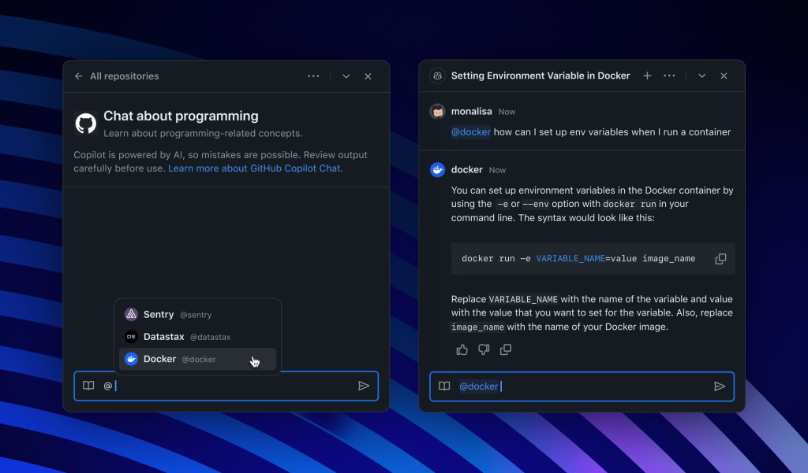
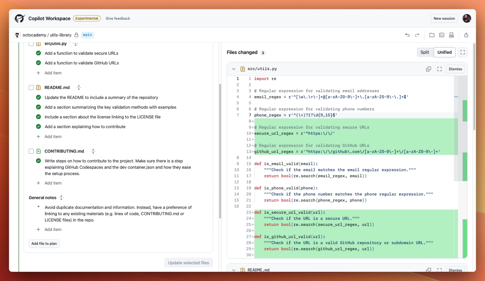

## Copilot Chat
- 개발자의 에디터에서 ChatGPT와 유사한 경험을 제공
- Generic questions : 일반적인 소프트웨어 관련 각종 질문들
- Generate unit tests : 코드 블럭 선택하여 유닛 테스트 생성
- Explain the code : 코드 블럭 선택하여, 코드 설명
- Propose a fix for bug : 버그 수정
- 언어간 변환 : 코드 블럭 선택하여, 다른 언어로 변환
- 리팩토링 : 코드 블럭 선택하여, 리팩토링 제안
- documentation : 코드 블럭 선택하여, 문서화 제안
  
  <video src="https://github.githubassets.com/assets/hero-lg-6a98e47708e8.mp4" width="700" height="450" controls> </video>

  

## Code 완성
- 코드 작성시, 자동완성 기능을 제공
- 커맨트(주석)를 코드로 변환
- 반복적인 패턴을 인식하여 자동완성
- 선택할 수 있는 여러가지 대안 코드를 제안해 주어, 개발자가 선택할 수 있도록 함
  

## Copilot for CLI
- 자주 잊기 쉬운 CLI 명령어들을, Copilot에서 질의하여, 필요한 CLI 명령어를 제안 받아 사용
- [GitHub Help 사용 설명서](https://docs.github.com/en/enterprise-cloud@latest/copilot/using-github-copilot/using-github-copilot-in-the-command-line)
- 3가지 쉘 커맨드 지원 
    - 일반적인 shell 명령어
    - Git CLI 명령어
    - GitHub의 CLI 명령어
- IDE의 GitHub Copilot 플러그인과 상관없이, '별도 CLI용 패키지' 설치 필요 ([설치관련 가이드](https://github.com/github/gh-copilot))

    <iframe width="700" height="450" src="https://www.youtube.com/embed/fHwtrOcLAnI" title="NOW AVAILABLE: GitHub Copilot in the CLI" frameborder="0" allow="accelerometer; autoplay; clipboard-write; encrypted-media; gyroscope; picture-in-picture; web-share" referrerpolicy="strict-origin-when-cross-origin" allowfullscreen ></iframe>

## GitHub Enterprise Web UI상에서 Document 
- GitHub Enterprise Cloud의 웹 UI상에서, 소스코드, 문서에 대한 검색
- Enterprise Cloud상에 존재하는 기업의 Private 저장소의 소스코드에 대한 질의 응답

  <video src="https://github.com/images/modules/site/copilot/features-breakout.mp4" width="700" height="450" controls> </video>

## Pull request 자동 summary
- Pull Request 작성시 기입하여야 하는 코맨트, 설명등을 Copilot이 자동으로 PR변경사항으로 작업
 <iframe width="700" height="450" src="https://www.youtube.com/embed/Pq_6AhwtOHw" title="GitHub Copilot Enterprise: Mastering PR Summaries" frameborder="0" allow="accelerometer; autoplay; clipboard-write; encrypted-media; gyroscope; picture-in-picture; web-share" referrerpolicy="strict-origin-when-cross-origin" allowfullscreen ></iframe>

## [Copilot Extensions](https://github.blog/2024-05-21-introducing-github-copilot-extensions/)
- Copilot Extensions는 Copilot Chat의 기능을 다양한 엔터프라이즈에 사용하는 도구들과 연계하여 확장합니다. 

- GitHub Copilot Extensions은 DataStax, Docker, LambdaTest, LaunchDarkly, McKinsey & Company, Microsoft Azure 및 Teams, MongoDB, Octopus Deploy, Pangea, Pinecone, Product Science, ReadMe, Sentry 및 Stripe와의 확장을 지원합니다. 확장 기능은 GitHub.com, Visual Studio 및 VS Code의 GitHub Copilot Chat에서 지원됩니다.
- 만약 데이터베이스 관련 오류로 인한 문제를 해결하기 위한 상황이라면, GitHub 이슈나 DataStax의 감사 로그등의 다양한 도구에서 문제의 맥락을 파악하려고합니다. 충분한 맥락을 갖고 있으면 Sentry와 같은 오류 모니터링 도구로 이동하여 자세한 내용을 알아냅니다. 이후 해결책을 찾고 수정을 적용한 다음 Azure로 배포합니다. 이 시나리오에서는 맥락 전환이 많이 발생합니다.
- GitHub Copilot Chat에서는 이제 이러한 도구를 쉽게 호출하여 컨텍스트를 얻고 작업을 수행하며 파일과 pull request를 생성할 수 있습니다. 이를 통해 다양한 도구 간의 워크플로우를 가속화할 수 있습니다.

- GitHub Marketplace은 모두가 활용할 수 있도록 확장 기능을 제공하지만, 기업은 자체적인 개발 도구에 대한 비공개 Copilot Extensions를 생성할 수도 있습니다. 이를 통해서 내부 API 라이브러리를 활용하거나, 자체 모니터링 시스템의 정보를 활용할 수 있는 것과 같은 기능을 쉽게 개발할 수 있습니다.

## [Copilot Workspace](https://github.blog/2024-04-29-github-copilot-workspace/)
- GitHub Copilot Workspace는 Copilot 기반 개발 환경입니다. Copilot Workspace에서 개발자는 자연어로 아이디어를 떠올리고, 계획을 세우고, 코드를 작성하고, 테스트하며, 실행할 수 있습니다.

- 개발자들에게 가장 큰 진입 장벽은 대부분 처음 시작할 때 발생합니다. 큰 프로젝트, 기능 요청 또는 버그 리포트의 첫 단계에서 자주 막히는 것을 느낄 수 있습니다. 단순히 시작하는 방법을 모르기 때문에 처음에 어려움을 겪는 경우가 많습니다.
- Copilot Workspace는 코드베이스, Issue 응답 등을 깊이 이해하여 문제를 해결하기 위한 단계별 계획을 제공합니다. 이것은 검증할 계획과 코드를 한 곳에서 자연어로 효율적으로 제공합니다.
- GitHub Copilot Workspace가 제안하는 모든 것은 계획부터 코드까지 모두 편집 가능하며, 앞으로 나아갈 경로에 대해 자신감을 갖을 때까지 반복할 수 있습니다. Copilot Workspace는 인지적인 부담을 줄이면서도 모든 자율성을 유지합니다.
- 계획에 만족하면 Copilot Workspace에서 코드를 직접 실행하고, GitHub에 내제된 GitHub Codespace로 이동하여 최종 결과에 만족할 때까지 모든 코드 변경을 조정할 수 있습니다. 또한 팀과 공유 링크를 통해 워크스페이스를 즉시 공유하여 다른 사람들이 작업을 확인하고 자신의 반복을 시도할 수 있습니다.

## Fine-tuned models
- Copilot이 제안하는 코드의 정확도를 높이기 위해, Fine-tuned model을 사용하여, 코드 제안의 정확도를 높임
- Fine-tuned model은 사용자의 코드 스타일, 프로젝트의 특성등을 반영하여, 코드 제안의 정확도를 높임
- 모델에 학습시킬 데이터(소스코드 저장소)는 <U> 반드시 GitHub Enterprise Cloud에 저장되어 있어야 함 </U>

